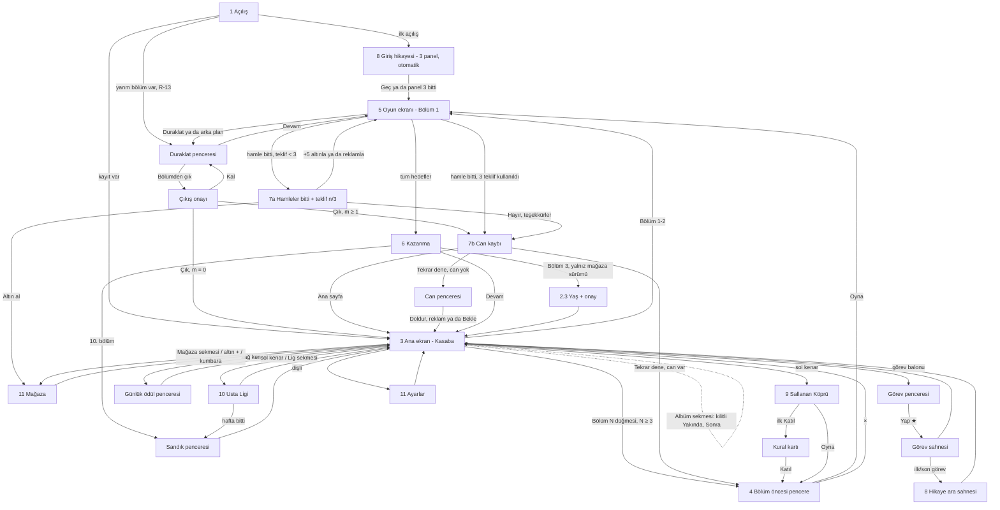

# UX akışları — Minik Usta

Sahip: design-lead · Durum: Faz 1 revizyonu (2026-10-04; orkestratör kararları R-01…R-24 işlendi) · Kaynak:
`docs/BRIEF.md` §4, §8, §10, §11 · Görsel tarifler: `docs/ART_DIRECTION.md` · Animasyonlar: `docs/JUICE.md` · Metinler:
`docs/STORY.md` · Ölçüler: `src/theme/tokens.json` · Sayılar (fiyat, ödül, tavan): `config/economy.json`,
`config/events.json` — bu belgedeki sayılar **örnektir**, ekran değeri her zaman config'ten okunur.

**Kapsam etiketleri** (BUSINESS §12.1): **[MVP]** web MVP'de var · **[MVP-lite]** sade sürüm · **[Sonra]** MVP'de yok,
yeri ayrılmış · **[Mağaza]** yalnız Capacitor/mağaza sürümü. Etiketsiz satırlar MVP'dir.

---

## 0. Ölçü sistemi

### 0.1 Tasarım çözünürlüğü ve telefona eşleme

- Tasarım tuvali **1080×1920 px** (dikey). Tüm wireframe koordinatları bu tuvalde, sol üst (0, 0).
- **Telefona eşleme:** 375 pt genişlikte 1 pt = 2,88 px; 390 pt'de 1 pt = 2,77 px. Yani 1080 px genişlik = telefonun
  tam genişliği. Örnek: 120 px hücre = 41,7 pt (375) / 43,3 pt (390); 172 px güçlendirici yuvası = 60 / 62 pt.
- **44 pt kuralı:** en küçük dokunma hedefi 375 pt'de 44 pt = **128 px**. Token: `touch.minTargetPx = 128`. Görseli
  daha küçük olan öğeler (blok hücresi 120 px) görünmez **dokunma payı** (`touch.hitSlopPx = 30`, 0,25 hücre) ile
  180 px'e çıkar; birden çok bloğun payı aynı noktayı kapsarsa dokunuş merkezine en yakın hücreye gider.
- **Ölçekleme — FIT ve EXPAND (R-06; EXPAND önerisi P-4, proje sahibine soruldu):** Brif FIT diyor: tuval 1080×1920
  sabit, uzun ekranda üst/alt bant (390×844'te toplam 151 pt) arka plan rengiyle dolar. Öneri EXPAND: genişlik 1080
  sabit, yükseklik `H` ekran oranına göre **1920–2400 px** (Phaser `Scale.EXPAND`). Düzen **iki kipte de aynı çapa
  sözleşmesiyle** çalışır (`tokens.layout._doc`):
  - **Üst grup** (`layout.top.*`, y üstten): duraklat, panorama, hedefler, hamle sayacı, ana ekran üst çubuğu.
  - **Alt grup** (`layout.bottom.*`, y alttan, `*BottomPx`): Tuna köşesi, güçlendirici çubuğu, alt navigasyon,
    "Bölüm N" düğmesi.
  - **Tahta grubu** (`layout.board.*`): vinç alanı + tahta + durum şeridi; y değerleri 1920 içindir, `H > 1920` iken
    `(H − 1920) × board.expandShare (0,5)` kadar aşağı kayar. FIT'te `H = 1920` → kayma 0.
  - **Pencereler** `H` içinde dikey ortalanır; seçenek düğmeleri pencerenin altına dizilir (`layout.popup.*`).
  - Arka plan katmanları 1080×2400 çizilir (ASSET_LIST §6); fazladan yükseklik gökyüzü ve yakın katmanla dolar.
  Bu belgedeki wireframe'ler `H = 1920`'yi gösterir; 2337 px'te (390×844, EXPAND) tahta 208 px aşağı kayar ve başparmak
  bölgesine yaklaşır. Ekran görüntüleri iki profilde de incelenir (`ios67` 1290×2796, `android` 1080×1920; TECH §12).
- Güvenli alan (çentik): `index.html` oyun kabını `env(safe-area-inset-*)` ile içeri alıyor; tasarım tuvali zaten güvenli
  alanın içindedir. Ek olarak üstte 24 px, altta 24 px kenar boşluğu.

### 0.2 Başparmak bölgesi

```
 y=0    ┌──────────────────────────────┐
        │  ZOR ERİŞİM  (üst %30)       │  duraklat, geç, kapat (×) — bilinçli olarak zor:
 y=576  ├──────────────────────────────┤  yanlışlıkla basılmasın
        │  ESNEME  (%30–%55)           │  tahtanın üst satırları, vinç alanı (imza "yukarı" hareketi)
 y=1056 ├──────────────────────────────┤
        │  RAHAT  (alt %45)            │  Oyna, Devam, güçlendiriciler, alt navigasyon,
        │                              │  pencere birincil düğmeleri, +5 hamle, bloklar (alt satırlar)
 y=1920 └──────────────────────────────┘
```

Kural: her ekranın **birincil eylemi y ≥ 1400** (alt %27) ve en az 128 px yüksekliktedir. Kapat/Geç/Duraklat gibi
geri dönüşü olan ikincil eylemler üst köşelerde durabilir. Tahta istisnadır: imza hareket "yukarı" gerektirir;
blok parmağın 1,2 hücre üstünde göründüğü için parmak bloğun altında, daha rahat bölgede kalır.

### 0.3 Ortak kalıplar

| Kalıp | Tarif |
| ----- | ----- |
| Birincil düğme | yeşil, en az 560×160 px, 3B dudak 12 px, metin `font.size.button` (56 px) beyaz + kontur |
| İkincil düğme | turuncu, 400×144 px |
| Nötr düğme | dolgulu krem (`ui.neutral` / `neutralLip`), yazı `ui.ink`; ikincil düğmeyle **aynı boyda** kullanılır. "Hayır, teşekkürler", "Reklam izle", "Kal" gibi seçenekler bu kalıptır |
| Metin düğme | dolgusuz, `ui.inkSoft`, alt çizgi yok, dokunma alanı ≥ 128 px yükseklik. **Satın alma ya da reklam penceresinde reddetme seçeneği olarak kullanılmaz** (R-15) |
| Fiyat etiketi (`PriceLabel`) | Altınla fiyatlanan **her** düğmede iki satır: üstte "● 900" (`font.size.button`), altta gerçek para karşılığı yerel para biriminde: TR "≈ 81 TL", EN "≈ $1.79" (`font.size.caption`, `ui.inkSoft`; asla altından büyük değil; mağaza sürümünde para birimi mağaza yerel ayarından). Karşılık `config/economy.json`'daki referans fiyattan (Avuç paketi birim fiyatı) hesaplanır; web MVP'de yanında "test sürümü" etiketi (E9). Tek bileşen, bütün pencerelerde aynı (E2) |
| Teklif penceresi kuralı (R-15) | Seçenekler **eşit boyutlu** (920×152, alt alta, `layout.popup.*`); hiyerarşi yalnız renkle (turuncu / krem / krem). Döngüsel dikkat animasyonu, geri sayım, "son şans", kayıp vurgusu, kalan oyuncu sayısı yok. × kapat her zaman var ve "Hayır" ile aynı sonucu verir |
| Bot satırı (R-14) | Avatar = blok renklerinden birinde kask + küçük alet simgesi (`chr_bridge_helmet_bot_*`), ad `npc.apprentice.*` (STORY §7.4) + küçük "çırak" rozeti (`ui.botBadge`). Bayrak, çevrimiçi ışığı, alt çizgili kullanıcı adı yok. Oyuncu satırı "Sen" + Tuna kaskı |
| Kapat (×) | kırmızı daire Ø 112 px görsel + 16 px pay = 144 px hedef; pencerenin sağ üst köşesine 40 px taşar |
| Pencere | krem panel, kenar 12 px `panelEdge`, köşe 48 px, arkada `ui.overlay` %55; açılış 220 ms (JUICE) |
| Rozet | Ø 56 px kırmızı (#E8473B) daire, beyaz sayı ya da "!" |
| Kilitli öğe | %55 gri (`ui.disabled`) + asma kilit 64 px + açılış bölümü ("Bölüm 15"); dokununca 1,2 s ipucu balonu "Bölüm 15'te açılır" |
| Yükleniyor | bloklardan dönen mini vinç döngüsü (96 px) + 0,4 s gecikmeyle görünür (kısa yüklemede titreşim olmasın) |
| Hata | krem panel + Kepçe "kafası karışık" + kısa metin + "Tekrar dene"; kırmızı çarpı ve suçlayıcı dil yok |
| Boş durum | Kepçe kazıyor illüstrasyonu + tek satır açıklama + (varsa) eyleme götüren düğme |
| Geri | Android geri tuşu / tarayıcı geri = en üstteki pencereyi kapat; oyun ekranında = Duraklat penceresi |
| Animasyon sırasında girdi (R-12) | Oyuncu animasyon sürerken yeni blok **tutabilir**: tutma anında tahtayı değiştiren bekleyen animasyonlar son karesine atlar (parçacık ve ses kendi hızında sürer), sürükleme gerçek durumdan başlar. Girdi yalnız **dilim kayması (600 ms), kamyon teslimatı (700 ms) ve Kamyon Yardımı / karıştırma (900 ms)** sırasında kilitlidir; bu sırada dokunuş diziyi 3× hızlandırır. Ayrıntı: JUICE §0 kural 3 |

---

## 1. Açılış (Splash / yükleme)

```
y    0 ┌────────────────────────────────────┐
       │            gökyüzü #7FD3F7          │
  300  │      ▣ ▣   bloklar yukarıdan       │  "MİNİK USTA" logosu 8 bloktan inşa olur
  420  │   ┌──────────────────────────┐     │  logo kutusu 880×360, merkez (540, 560)
       │   │  M İ N İ K   U S T A     │     │
  740  │   └──────────────────────────┘     │
  900  │        ☺ Tuna      🐕 Kepçe          │  Tuna kaskını düzeltir, Kepçe havlar (840×520 sahne)
 1420  │   ══════════════════════════      │  zemin çizgisi
 1560  │   ⌐▀▀▀▀▀▀▀▀▀▀▀▀▀▀▀▀▀▀▀▀▀▀▀▀▀▀▀¬     │  yükleme: vinç kolu 840 px; kanca bloğu soldan sağa taşır
 1640  │   [▣]──────────────▶               │  blok konumu = yükleme yüzdesi
 1840  │              v0.1.0  (34 px)       │
 1920  └────────────────────────────────────┘
```

| Öğe | Konum / boyut | Not |
| --- | ------------- | --- |
| Logo | 880×360, merkez (540, 560) | 8 blok (W Y G R O C B P) düşer ve oyun adı yazısının arkasında kutuları oluşturur; yazı Baloo 2 800, 120 px. **Ad marka sabitinden** (`app.title` i18n) gelir; "MİNİK USTA" çalışma adıdır ve NAMING kararına kadar logo yer tutucudur. Düzen 8–12 harflik adlara ölçeklenir: blok sayısı = harf grubu sayısı (en çok 8), yazı 880 px'e sığmazsa 120 → 96 px |
| Tuna + Kepçe sahnesi | 840×520, merkez (540, 1160) | Tuna kaskını düzeltir (0,6 s), Kepçe havlar (0,4 s). **[MVP-lite]**: karakter animasyonu Sonra; MVP'de durağan poz |
| Yükleme vinci | 840×200, y 1540–1740 | taşınan blok x = 120 + 720 × yüzde |
| Sürüm | merkez (540, 1840), 34 px `ui.inkSoft` | — |

Durumlar:

- **Yükleniyor:** varsayılan. Animasyon en az 1,5 s (logo tamamlansın), yükleme bitince en fazla 0,3 s bekleyip geçer.
- **Hata (kayıt bozuk / doku üretimi başarısız):** vinç durur, panel "Bir şeyler takıldı. Yeniden deneyelim mi?" +
  "Tekrar dene" (y 1600). Kayıt bozuksa yedek kayıt yüklenir (code-lead), oyuncuya teknik ayrıntı gösterilmez.
- **Boş / kilitli:** yok.
- **Geri dönen oyuncu:** splash → Ana ekran (FTUE değilse).
- **Yarım kalan bölüm (R-13):** kayıtta `inLevel` varsa splash → doğrudan **oyun ekranı**, bölüm kaldığı hamleden
  kurulur ve **Duraklat penceresi açık** gelir (başlık "Kaldığın yerden devam", birincil "Devam"). Can gitmez, seri
  bozulmaz; G-H sayacı ve animasyonlar sıfırdan başlar. Ayrıntı §5.1.
- **Ses:** ses kilidi açılmadan istenen sesler **atılır**, kuyruğa alınmaz (TECH §11.6); açılış sesleri süstür.

---

## 2. İlk oturum (FTUE)

Akış: **Açılış → 3 panelli giriş hikayesi (otomatik ilerler, atlanabilir) → doğrudan Bölüm 1 → Kazanma → Ana ekran →
ilk yıldızı harcama → ilk ara sahne → Bölüm 2 düğmesi.** (Sıra brif FTUE'sidir, R-09.) İlk oturumda bölüm öncesi
pencere **gösterilmez** (Bölüm 1–2); Bölüm 3'ten itibaren gösterilir (oyun öncesi güçlendiriciler 12'de açıldığı için
3–11 arası pencere sade). Pencere atlansa da can bölüm başında **ayrılır** ve kazanınca iade edilir (META §2); üst
çubukta bu ayırma gösterilmez.

### 2.1 "≤ 10 saniye ve ≤ 3 dokunuş" kanıtı

Ölçüm başlangıcı: uygulamanın ilk karesi (Capacitor'da native splash bitişi; web'de `DOMContentLoaded`). Bitiş: Bölüm 1
tahtasının etkileşime açıldığı kare.

| # | Adım | Süre (s) | Gerekli dokunuş | Kümülatif süre | Not |
| - | ---- | -------- | --------------- | -------------- | --- |
| 1 | Açılış animasyonu + yükleme | 2,0 (en az 1,5) | 0 | 2,0 | **Kritik yol yalnız:** font 38 KB (`document.fonts.load` bitmeden metin oluşturulmaz) + 3 giriş paneli (≤ 300 KB WebP/SVG yer tutucu). Doku pişirme, `level_001` derlemesi ve ses ön-çizimi panellerin **arkasında** yapılır (code-lead önerisi); diğer 44 panel tembel yüklenir. Bütçe: orta telefonda ≤ 2,0 s. |
| 2 | Giriş paneli 1 (otomatik) | 1,8 | 0 | 3,8 | Her panel 1,8 s sonra kendiliğinden geçer; dokunmak hemen geçirir. |
| 3 | Giriş paneli 2 (otomatik) | 1,8 | 0 | 5,6 | |
| 4 | Giriş paneli 3 (otomatik) | 1,8 | 0 | 7,4 | |
| 5 | Geçiş (panel → tahta, 0,4 s) + Bölüm 1 tahtası açılır | 0,6 | 0 | **8,0** | Usta Dede balonu ve el animasyonu tahtayla aynı anda gelir. |

- **Dokunuş:** gerekli dokunuş **0**. Oyuncu panelleri dokunarak hızlandırırsa en fazla 3 dokunuş (her panel 1) ya da
  "Geç" ile **1 dokunuş**; her durumda ≤ 3. ✓
- **Süre:** dokunmadan 8,0 s; panelleri dokunarak geçen oyuncu ~4–5 s. Yükleme bütçesi 2,0 s'yi 2 s aşsa bile 10 s
  içinde kalır (açılış animasyonu yüklemeyi örter; paneller yükleme bitmeden başlamaz). ✓
- **Ses kilidi:** tarayıcılar sesi ilk kullanıcı dokunuşuna kadar engeller. İlk dokunuş (panel ya da blok) sesi açar;
  dokunmadan geçen oyuncu ilk bloğu tuttuğunda sesi duyar. Ayrı bir "Başlamak için dokun" ekranı **yok**.
- **Varsayım:** web sürümünde ilk ziyaret ağ indirmesi bu ölçümün dışındadır (paket boyutu bütçesi code-lead'in;
  öneri ≤ 1,5 MB gzip ilk yük). Kurulu uygulama ve tekrar ziyaret için yukarıdaki tablo geçerlidir.
- **Ölçüm kapısı:** iddia `npm run perf`'te otomatik doğrulanır (soğuk başlangıç, 4× CPU yavaşlatma; web ilk ziyaret
  için ayrıca "Fast 4G"); gezinme başlangıcı → `window.__levelInteractive` ≤ 10 s. Phaser paket ayrıştırması (0,3–0,8 s,
  tahmin) 2 s'lik payın içindedir; aşılırsa önce panel süresi 1,8 → 1,5 s'ye iner.

### 2.2 FTUE adımları (Bölüm 1 sonrası)

| # | Ekran | Ne olur | Vurgu / el | Dokunuş |
| - | ----- | ------- | ---------- | ------- |
| 6 | Kazanma | Kısa kazanma gösterisi (≤ 3 s), yıldız ana ekrana uçar | "Devam" düğmesi nabız | 1 (Devam) |
| 7 | Ana ekran | İlk açılış: alt nav ve kenar ikonları gizli (yalnız üst çubuk, görev balonu, "Bölüm 2"). Yıldız sayacı 1'i gösterir | görev balonu (ünlemli) spot ışığında, el dokunma animasyonu | 1 (görev balonu) |
| 8 | Görev penceresi | `town.ch1.t1.name` ("Ağaç basamakları") + maliyet (★ META'dan) | "Yap ★1" düğmesi | 1 |
| 9 | Görev sahnesi | Ağaç ev basamakları yükselir (≤ 2 s), `town.ch1.t1.scene` balonu | — | 0 |
| 10 | İlk ara sahne (Bölüm 1 başlangıç) | 4 panel (STORY: `story.ch1.start`) | dokununca ilerler, "Geç" | 1–4 |
| 11 | Ana ekran | Alt navigasyon **Bölüm 5'te**, kenar ikonları açıldıkça belirir (bkz. §3) | "Bölüm 2" düğmesi nabız | 1 |

İlk oturumun "önce oyun, sonra meta" sırası: ilk meta dokunuşu, ilk kazanmadan sonradır.

### 2.3 Yaş ve onay ekranı **[Mağaza]** (R-23, BUSINESS S12)

Web MVP'de yok; akıştaki yeri şimdiden ayrılır. Konum: **Bölüm 3 Kazanma "Devam" → Yaş → Onay (CMP) → Ana ekran.**
Hiçbir reklam/analitik SDK bu adımdan önce başlamaz (code-lead `ConsentService`). FTUE ölçümü (Bölüm 1'e ≤ 10 s, ≤ 3
dokunuş) etkilenmez.

```
y  200 │   Doğum yılın                      │  h1, ortada; karakter, ödül, ipucu yok
  420  │   ┌──┐┌──┐┌──┐┌──┐                 │  4 haneli boş alan (varsayılan yok, kaydırma çarkı yok)
  560  │   └──┘└──┘└──┘└──┘                 │
  900  │   [1][2][3]                        │  sayısal tuş takımı, her tuş 160×128, alt yarıda
       │   [4][5][6]   [7][8][9]   [⌫][0]   │
 1640  │   ┌──────────── DEVAM ───────────┐ │  birincil; 4 hane girilince etkin
```

Nötr metin; "18" ya da yaş eşiği ipucu yok. Geçersiz yıl (gelecekte ya da 120 yıldan eski) → alan 2 px titrer +
"Yılı kontrol eder misin?" (suçlayıcı değil).

---

## 3. Ana ekran (Kasaba)

```
y    0 ┌────────────────────────────────────┐
   40  │ [♥ 5  29:12] [● 1.250 (+)] [★ 3]   │  üst çubuk h 112: can 300, altın 360, yıldız 240
  152  ├────────────────────────────────────┤
       │ ┌──┐                         ┌──┐ │  sol kenar: etkinlik ikonları 152×152, x 24
  420  │ │Kö│ 5s 12d                   │Gü│ │  (Sallanan Köprü + kalan süre rozeti)
  600  │ └──┘                         └──┘ │  sağ kenar: günlük ödül, kumbara, sandık, x 904
       │ ┌──┐   ~~ aktif yapı ~~      ┌──┐ │
  780  │ │Li│   (yarı inşa, paralaks) │Ku│ │  (Usta Ligi + sıra rozeti "#12")
  960  │ └──┘        ┌───────┐       └──┘ │
       │             │  (!)  │ görev    ┌──┐ │  görev balonu 200×200, yapı üstünde
 1140  │             │ ★1    │ balonu   │Sa│ │
       │             └───────┘          └──┘ │
 1320  │                                    │
 1440  │      [ZOR]  etiketi (varsa)        │  etiket 240×80, düğmenin sol üstüne taşar
 1480  │   ┌────────────────────────────┐   │
       │   │        BÖLÜM 12            │   │  birincil düğme 720×176, merkez (540, 1568)
 1656  │   └────────────────────────────┘   │
 1720  ├──────┬──────┬────────┬──────┬──────┤
       │Mağaza│ Lig  │  ANA   │Takım │Albüm │  alt nav h 176: 5 sekme × 216 px
       │  🛒  │  🏆  │  🏠    │ 🔒   │ 🔒   │  ortadaki seçili sekme 24 px yükselir; Takım ve Albüm kilitli "Yakında"
 1896  └──────┴──────┴────────┴──────┴──────┘
```

| Öğe | Konum / boyut | Davranış |
| --- | ------------- | -------- |
| Can | (24, 40) 300×112 | Kalp + sayı + yenilenme sayacı (dolu ise "Dolu"); sınırsız can süresinde kalp içinde ∞ + geri sayım. Dokun → Can penceresi (§3.1). |
| Altın | (348, 40) 360×112 | Sikke + sayı + yeşil (+) 80 px. Dokun → Mağaza. |
| Yıldız | (732, 40) 240×112 | Yıldız + sayı. Dokun → görev penceresi. |
| Ayarlar | (996, 52) 72×88 görsel + pay → 128 px | Dişli. Dokun → Ayarlar. |
| Sol kenar | x 24, 152×152, y 420 / 780 | Sallanan Köprü (Bölüm 15), Usta Ligi (Bölüm 25). Açılmadan önce gizli. |
| Sağ kenar | x 904, 152×152, y 420 / 780 / 1140 | Günlük ödül (2. gün; §3.1), Kumbara (20; dokun → Mağaza kumbara kartı), Bölüm sandığı (ilerleme halkası Bölüm 1'den görünür; 10 bölümde dolar; §3.1). |
| Görev balonu | 200×200, aktif yapının üstünde | Ünlem + yıldız maliyeti; yetecek yıldız varsa zıplar (2 s'de bir). |
| Bölüm düğmesi | 720×176, `layout.bottom.playButtonBottomPx` 264 | "BÖLÜM 12". Zor: kırmızı "ZOR" etiketi; Çok Zor: mor "ÇOK ZOR" etiketi + düğme kenarında ince ikaz şeridi. |
| Alt navigasyon | `layout.bottom.navBottomPx` 24, h 176, 5 × 216 | Mağaza · Lig · **Ana Sayfa** · Takım (kilitli, "Yakında") · Albüm (**[Sonra]** kilitli, "Yakında"; R-19). Bölüm 5'ten önce gizli. |

Durumlar:

- **Boş:** görev yok (bütün hikaye bölümlerinin görevleri bitti; yalnız Hikaye 5 sonunda oluşur) → görev balonu yerine
  "Yeni yapılar yolda" rozeti.
- **Yükleniyor:** kasaba sahnesi hazır değilse (ilk geçişte ≤ 300 ms) gökyüzü + düğme hemen görünür, yapı belirerek gelir.
- **Hata:** etkinlik verisi üretilemezse ikon gri + "!" rozeti; dokununca "Etkinlik şu an hazır değil. Biraz sonra bak."
- **Kilitli:** kilitli kenar ikonları gösterilmez (sürpriz açılış); alt nav'da Takım ve Albüm kalıcı kilitli ("Yakında").
- **Can yok:** Bölüm düğmesi gri değil (oyuncu yine dokunabilir) → Can penceresi (§3.1).
- **İçerik sonu (Bölüm 50 bitti):** düğme "Usta Modu" — **MVP (onay bekliyor, R-17)**; Usta Modu MVP'ye girmezse
  "Yeni bölümler yolda" (pasif) + "Devamı yolda…" sahnesi (STORY §4.5 son panel, MVP).

### 3.1 Ana ekran pencereleri

**Can penceresi** (can 0 iken Bölüm düğmesi ya da kalbe dokunma):

```
       │  CAN DOLDUR                (×)     │
       │  ♥ 0   Sonraki can: 12:40           │  geri sayım (nötr, kırmızı değil)
       │ ┌──────────────────────────────────┐│
       │ │ Tam can (5)      ● 900           ││  920×152, turuncu; PriceLabel
       │ │                  ≈ 81 TL         ││
       │ └──────────────────────────────────┘│
       │ ┌──────────────────────────────────┐│
       │ │ ▶ Reklam izle · +1 can (bugün 2/2)││  920×152, krem; tavan dolunca gri + "Yarın tekrar"
       │ └──────────────────────────────────┘│
       │ ┌──────────────────────────────────┐│
       │ │ Bekle                            ││  920×152, krem; pencereyi kapatır
       │ └──────────────────────────────────┘│
```

Altın yetmezse "Tam can" düğmesi "Altın al" olur → Mağaza (eksik altını karşılayan en küçük paket vurgulu, §11).
Ödüllü reklam **[MVP yer tutucu]**: MVP'de sahte reklam (2 s yer tutucu), mağaza sürümünde gerçek SDK. Reklam
yüklenemezse düğme gri "Şu an reklam yok"; **gizlenmez** (BUSINESS §4.3).

**Günlük ödül penceresi** (sağ kenar ikonu; 2. gün açılır):

```
       │  GÜNLÜK HEDİYE                (×)  │
       │  ┌──┐┌──┐┌──┐┌──┐┌──┐┌──┐┌────┐    │  7 kutu 112×160 + 7. gün 160×160; içerik ikonları
       │  │✓ ││✓ ││▣ ││  ││  ││  ││ ★  │    │  hepsi ÖNCEDEN görünür
       │  └──┘└──┘└──┘└──┘└──┘└──┘└────┘    │  bugünkü kutu (3) vurgulu, alınanlar ✓
       │  Bir gün gelmezsen ilerlemen        │  body, ui.inkSoft — E10
       │  kaybolmaz.                         │
       │  [   TOPLA   ]  [ ▶ Reklam · ×2 ]   │  eşit boy 440×152; reklam günde 1, tavanda gri "Yarın tekrar"
```

Kaçırılan gün döngüyü **sıfırlamaz, durdurur**: sıradaki kutu "bekliyor" (küçük saat simgesi) olarak kalır; sıfırlama
animasyonu, "Seriyi kaybetme!" uyarısı ve geri sayım yok. Ödüller `config/economy.json`'dan. Toplama → JUICE #74.

**Bölüm sandığı / lig sandığı açılışı** (E1; kumar algısı yok):

```
       │  BÖLÜM SANDIĞI                     │
       │   İçinde: 🔨1  ● 200  ⏱ 15 dk ∞♥    │  içerik ikonları kapalı sandığın ÜSTÜNDE baştan görünür
       │        ┌────────────┐               │
       │        │  sandık    │               │  ahşap alet sandığı 400×320
       │        └────────────┘               │
       │   [          AÇ          ]          │  birincil
```

Açılış = kapak kalkar (400 ms) → ikonlar **gösterilen sırayla** üst çubuğa uçar (120 ms arayla). Dönen çark, slot,
yavaşlayan kart, "neredeyse" animasyonu ve rastgele seçim görseli **yok**; içerik sabittir ve açılmadan önce bellidir.
Lig sandığı aynı pencereyi kullanır (Lig sonuç penceresinden açılır).

---

## 4. Bölüm öncesi pencere

```
y  300 ┌────────────────────────────────────┐ (×) 144 px hedef, köşe (1000, 300)
       │  ┌──────────────────────────────┐  │  panel 960×1280, x 60–1020
  360  │  │      BÖLÜM 12      [ZOR]     │  │  başlık h1 88 px
  480  │  ├──────────────────────────────┤  │
       │  │   ┌──────────┐  ┌───┐ ┌───┐ │  │  hedefler: yapı resmi 280×280 + ek hedefler 160×160
       │  │   │ Tezgâh   │  │▦×6│ │✦×5│ │  │
  800  │  │   └──────────┘  └───┘ └───┘ │  │
  860  │  │  Galibiyet serisi: ▰▰▱ (2)   │  │  seri göstergesi 760×100 (Bölüm 15+)
  980  │  │  ┌────┐  ┌────┐  ┌────┐      │  │  3 oyun öncesi güçlendirici yuvası 200×200
       │  │  │ 🧪 │  │ 🪣 │  │ ▤↑ │      │  │  seçilince yeşil çerçeve + ✓
 1180  │  │  └────┘  └────┘  └────┘      │  │
 1380  │  │  ┌────────────────────────┐  │  │
       │  │  │         OYNA           │  │  │  birincil 640×176, merkez (540, 1468)
 1556  │  │  └────────────────────────┘  │  │
 1580  └──┴──────────────────────────────┴──┘
```

| Öğe | Not |
| --- | --- |
| Başlık | "BÖLÜM 12" + zorluk etiketi (Kolay/Normal etiketsiz). |
| Hedef kutusu | Yapı parçasının küçük resmi (panoramadan render, adıyla: "Tezgâh"), ek hedefler sayaçlı ikon. |
| Galibiyet serisi | 3 basamaklı gösterge; seçili basamağın bonusu ikonla (Altın Mala / Termos). Bölüm 15 öncesi gizli. |
| Güçlendirici yuvaları | Termos (12), Mala Başlangıcı (16), Açık Kepenk (20). Adet rozeti; 0 ise "+" (altınla al). Dokun = seç/bırak. |
| Oyna | Seçili güçlendiriciler harcanır, oyun ekranına geçiş. İlk hamleden önce bölümden çıkılırsa iade edilir (K-40, K-43). |

Durumlar: **kilitli yuva** (açılış bölümü yazılı asma kilit) · **adet 0** ("+" → mini satın alma penceresi: güçlendirici
ikonu + tek satır açıklama + `PriceLabel`'lı "Al" ve eşit boyda krem "Hayır, teşekkürler"; yalnız oyuncu "+"ya dokununca açılır,
kendiliğinden asla; altın yetmezse "Altın al" → Mağaza) · **seçilemez yuva** (Açık Kepenk, bölümde Kepenk W4 ya da
Kilitli W7 yoksa: gri, "Bu bölümde kepenk yok"; K-40) · **can yok** (Oyna yerine "Can bekleniyor 12:40" + "Doldur" →
Can penceresi) · **yükleniyor** (yok; bölüm verisi yereldir) · **hata** (bölüm JSON doğrulaması başarısız → "Bu bölüm
hazırlanamadı" + Ana ekran; analytics olayı).

---

## 5. Oyun ekranı

### 5.1 Düzen

```
y    0 ┌────────────────────────────────────┐
   40  │[II] ┌─panorama──────────────┐ ┌───┐│  duraklat 128×128 (24,40)
       │     │ ▣▣ ▣▣ ░░ ░░ ░░        │ │ 24 ││  panorama 592×110 (168,40)
  152  │     ├─hedefler──────────────┤ │hml││  hamle sayacı 280×224 (776,40)
       │     │ 🏠  ▦ 4/6   ✦ 2/5     │ │   ││  hedefler 592×104 (168,160)
  264  │     └───────────────────────┘ └───┘│
  288  │ · · · · · · · · · · · · · · · · · ·│  VİNÇ ALANI y=9  (288–408)
       │ · · · · · · · · · · · · · · · · · ·│  VİNÇ ALANI y=8  (408–528)
  528  │┌──────────────────────┐┃┌────────┐ │  ─ ─ ─ ─ kesik sınır çizgisi
       ││ ■ ■ ■ ■ ■ ■          │┃│ ▒  ▒   │ │  satır 7
       ││ ■ ■ ■ ■ ■ ■          │┃│ ▒  ▒   │ │  saha x 30–750 (6×120)
       ││ ■ ■ ■ ■ ■ ■          │ │ ▒  ▒   │ │  duvar x 750–810 (60), geçit = boşluk
       ││ ■ ■ ■ ■ ■ ■          │┃│ ▒  ▒   │ │  şantiye x 810–1050 (2×120)
       ││ ■ ■ ■ ■ ■ ■          │┃│ ▒  ▒   │ │
       ││ ■ ■ ■ ■ ■ ■          │┃│ ▒  ▒   │ │
       ││ ■ ■ ■ ■ ■ ■          │┃│ ▒  ▒   │ │
 1488  │└──────────────────────┘┃└────────┘ │  satır 0
 1504  │ Usta Serisi ●●●○ [mala]  🚚 Kamyonda:3│  durum şeridi h 96
 1600  ├────────────────────────────────────┤
       │ ☺🐕     ┌────┐┌────┐┌────┐┌────┐   │  Tuna+Kepçe 280×296 (16,1600)
       │ Tuna    │ 🔨 ││ 🪝 ││ 🖌 ││ ↶  │   │  güçlendirici yuvaları 172×172, x 314–1056
       │ Kepçe   │ 2  ││ 1  ││ 🔒 ││ +  │   │  y 1660–1832
 1896  └─────────┴────┘└────┘└────┘└────┘───┘
```

Tahta: hücre `c` = `layout.grid.cellPx` 120 px; satır y (0 = en alt) → ekran üst kenarı
`boardBottomY − 120·(y+1)` (`boardBottomY` = 1488 + EXPAND kayması); sütun x (0–5) → `yardX + 120·x`, şantiye sütunu
x (6–7) → `buildX + 120·(x−6)`. Duvar 60 px'lik görsel bir şerittir; mantıkta sütun 5 ile 6 arasındaki sıfır genişlikli
sınırdır (R-03). Vinç alanı y=8–9 tahtanın üstünde, aynı sütun ızgarası. Tahta genişliği 1020 px (ekranın %94'ü).
Durum şeridi tahta grubuna aittir (tahtayla birlikte kayar); Tuna köşesi ve güçlendirici çubuğu alt gruba çapalıdır.

| Öğe | Davranış |
| --- | -------- |
| Duraklat | Duraklat penceresi: Devam (birincil), Ses/Müzik/Titreşim anahtarları, "Bölümden çık" → **çıkış onayı** (aşağıda). |
| Panorama | Planın tamamının küçük önizlemesi; dilimler 2 sütunluk sütunlar halinde, aktif dilim beyaz çerçeveli, tamamlananlar renkli, gelecekler gri çizgi. Dokun → 1,5 s büyük önizleme **[MVP-lite]**: oyun durumunu değiştirmez, hamle harcanmaz (K-06). |
| Hedefler | `build` için yapı ikonu + dilim sayacı ("2/4"), `clear` / `collect` sayaçları. Hedef tamamlanınca ✓ ve yeşil. |
| Hamle sayacı | Baloo 2 800, 120 px. Son 5 hamlede kırmızı nabız (JUICE). |
| Usta Serisi | 4 boncuk; dolunca Altın Mala ikonu parlar ve "dokun, kullan" durumuna geçer (seçim: §5.2). Renk körü modunda sayıyla da ("3/4"). |
| Kamyon göstergesi | Kuyrukta blok varsa görünür: "Kamyonda: 3" (K-26); yoksa gizli. Geri sekip yer bulamayan blok bu çipe uçar (K-17 adım 3). |
| Tuna + Kepçe | Etkileşimsiz tepki karakterleri (doğruda sevinç, hatalıda yüz buruşturma, komboda dans). Dokunulursa tek bir el sallama (işlevsiz). **[MVP-lite]**: MVP'de yalnız ifade değişimi; dans ve boşta göz kırpma Sonra. |
| Güçlendiriciler | Çekiç (8), Vinç (10), Boya Fırçası (22), Geri Al (13). Adet rozeti; 0 → "+" mini satın alma (§4'teki pencere; yalnız oyuncu dokununca açılır, bölüm duraklar). Kilitli → asma kilit + bölüm no. Ön koşulu sağlanmayan yuva gri (§5.2). |
| Harç maliyeti önizlemesi | Harçlı blok (Y8) sürüklenirken hamle sayacının altında "−2" çipi (K-07 hamle maliyeti). |

**Çıkış onayı (R-13, K-43):**

```
       │  BÖLÜMDEN ÇIK?                     │
       │  m = 0 : Henüz hamle yapmadın; can gitmez.        │  güçlendiriciler iade edilir
       │  m ≥ 1 : Çıkarsan 1 can gider.                     │  + seri sıfırlanır satırı (s > 0 ise)
       │  Köprüde (m ≥ 1) ek satır: Köprüden düşersin.       │
       │  [   KAL   ]   [   ÇIK   ]                         │  eşit boy 440×152; "Kal" yeşil, "Çık" krem
```

Geri tuşu ve × = "Kal". Uygulamanın kapanması, arama ya da sistem tarafından öldürülmesi **kayıp değildir**: her hamle
sonunda hamle günlüğü kaydedilir; bir sonraki açılışta bölüm kaldığı yerden, Duraklat penceresi açık olarak sürer
("Kaldığın yerden devam"). Kayıp yalnız bu onayla ya da hamleler bitince olur.

Durumlar: **ilk yükleme** (tahta 400 ms içinde bloklar yukarıdan yerine düşer; etkileşim bu animasyon bitince açılır)
· **kilitlenme** (K-30 Kamyon Yardımı; nedene göre 3 varyant, JUICE #21) · **hamle bitti** (Kaybetme penceresi) ·
**duraklatma** (uygulama arka plana atılınca otomatik; durum kaydedilir) · **devam** (yarım kalan bölüm; yukarıda) ·
**hata** (beklenmeyen durum: oyun kaydı alınır, "Bölümü baştan başlat" teklif edilir, can gitmez).

### 5.2 Güçlendirici kullanım akışı

1. Yuvaya dokun → yuva yükselir, tahta üstünde ince açıklama şeridi ("Kırmak için bir bloğa dokun") + "Vazgeç" (×).
   Seçilebilir hedefler 1,2 s'de bir parlar, seçilemeyenler %50 soluklaşır.
2. Hedef seçimi ve ön koşullar (GDD K-33, K-36…K-40; hedef kümeleri çekirdekten gelir, ör. `eligibleTrowelCells`):

| Güçlendirici | Seçilebilir hedef | Gri / seçilemez durum | Not |
| ------------ | ----------------- | --------------------- | --- |
| Çekiç (K-36) | saha bloğu, kasa, torba, moloz, yapışmış harçlı blok | kilitli (yerleşmiş) bloklar, kuyruktaki bloklar, duvar/geçit | Zincirli bloğa vurunca **yalnız zincir** kırılır (önizleme: zincir parlar) |
| Vinç (K-37) | zincirsiz, ıslak olmayan saha bloğu / moloz / harçlı blok | zincirli ve ıslak bloklar soluk + küçük kilit/damla rozeti | Hedef: sahada boş yer **ya da** şantiyede yalnız **doğru** konum (K-34 dahil). Taşırken gölge kuralı: geçersiz hedefte gölge gri, bırakınca blok geri döner ve vinç harcanmaz. Döndürme: blok üstünde 2 ok, 112 px. I5/Q9 şantiye üstünde gri |
| Boya Fırçası (K-38) | saha bloğu, yapışmış harçlı blok | moloz | Renk seçici yalnız **bu bölümün plan renklerini** gösterir (2–5 düğme, 112 px + sembol, alt yarıda) |
| Geri Al (K-39) | — (anında) | son eylem sürükleme değilse, Geri Al'dan sonra yeni hamle yapılmadıysa (derinlik 1), kayıp penceresi açıkken: yuva gri, dokununca "Geri alınacak hamle yok" balonu | Etkinken yuva ikonunda küçük nabız yok (sakin) |
| Altın Mala (K-33) | aktif dilimde **K-34'ü sağlayan** boş, `.` olmayan plan hücreleri = inşa cephesi (§5.4) | diğer hücreler %50 soluk | Geçerli hücreler altın kesik konturla nabız atar. Geçersiz hücreye dokunma: hücre 2 px titrer, mala harcanmaz |
| Açık Kepenk (K-40, oyun öncesi) | — | bölümde W4/W7 yok → bölüm öncesi pencerede gri "Bu bölümde kepenk yok" | Etkiyi yalnız Kepenk ve Kilitli geçitlerin üstündeki bayrak gösterir (JUICE #67) |

3. Uygulama animasyonu (JUICE) → adet −1. Vazgeçilirse ya da geçersiz hedefe dokunulursa adet düşmez.
4. Güçlendiriciler hamle harcamaz; hamle sayacı ve Usta Serisi değişmez (görsel geri bildirim de yok).

### 5.3 Sürükleme hissi (tasarım ilkesi 4)

| Parametre | Değer | Token |
| --------- | ----- | ----- |
| Sürükleme başlangıcı | parmak 8 px hareket **ya da** 100 ms basılı. Eşik altında bırakma = **dokunma** (hamle yok, iptal değil). K-07 bu eşiği sayı olarak içermez; kural testi token değerini okur (code-lead-2). Yol araması tutma anında yapılır, görsel kaldırma eşik aşılınca başlar | `drag.startThresholdPx`, `drag.holdMs` |
| Kaldırma | ölçek 1,00 → 1,08 (80 ms, easeOutBack), gölge belirir (`shadow.lifted`; vinç alanında `shadow.crane`) | `drag.liftScale` |
| Parmak ofseti | blok, tutulan hücresinin merkezi parmağın **1,2 hücre (144 px) üstünde** olacak şekilde 90 ms'de yukarı kayar | `drag.fingerOffsetCells` |
| Takip | blok her karede parmak + ofset konumuna **yumuşatmasız** gider (tek kare gecikme şartı). Mantıksal konum hücreye yuvarlanır, görsel konum süreklidir. | — |
| Eğim | yatay hıza göre ±4° (en fazla), 120 ms'de sönümlenir | `drag.tiltMaxDeg` |
| Yapışkan takip (K-08) | parmak ulaşılamaz yere giderse blok en yakın ulaşılabilir konumda kalır; ayrılık > 0,5 hücre ve > 150 ms ise bloktan parmağa noktalı **ip** (beyaz %60, 6 px) çıkar ve blok parmağa doğru 3° yaslanır | `drag.tetherDelayMs` |
| Çarpma | yapışkan takip bir engele dayandığında blok o yöne 6 px esneyip geri gelir (JUICE: "takip engele çarptı") | — |
| Vinç alanı tavanı (K-05, W2) | boyu > 2 olan blok duvar tepesinde takılırsa vinç alanının kesik sınır çizgisi ve sağ kenardaki "2 sıra" yükseklik işareti 400 ms parlar + çarpma esnemesi; ilk kez olunca bağlamsal öğretici `tut.ctx.tootall` | — |
| İptal öngörüsü (K-05, K-07) | bırakma iptal olacak bir konumdaysa (saha üstünde havada, duvar sınırını kesiyor) blok %60 opak olur ve üstünde 44 px "↩" rozeti görünür; bırakınca kavisle döner (hamle yok) | — |
| Bırakma (sahada) | hücreye 90 ms easeOutQuad oturma, ölçek 1,08 → 1,00 | — |
| Bırakma (şantiye üstü) | düşüş (K-11) | JUICE |
| Bırakma (geçerli değil) | başlangıç yerine 220 ms kavisle dönüş, hamle harcanmaz (K-07) | — |
| Tıklama (sürüklemeden) | blok 1 hücrelik zıplama (120 ms) + hafif haptik; hiçbir şey olmaz | — |
| Taşınamayan blok | dokununca 2 px sağ-sol titreme (3 döngü, 180 ms) + engelin (zincir, ıslak beton, üstünde blok) 300 ms vurgusu; hamle harcanmaz | — |
| Çoklu dokunuş | ikinci parmak yok sayılır (`activePointers: 2` ama sürükleme tek parmak) | — |

### 5.4 Düşüş gölgesi (K-18)

Blok şantiyenin üstündeyken (duvar üstünden ya da vinç alanından geçmiş) iniş konumu **her zaman** gösterilir; rüzgâr
(W8) ve balon (S8) dahil gerçek sonuç hesaplanır.

| Durum | Kolay / Normal | Zor / Çok Zor |
| ----- | -------------- | ------------- |
| Gölge gövdesi | bloğun hücreleri, iniş hücrelerinde: blok rengi %25 + 6 px kontur | aynı |
| Doğru yerleşim | **düz** 6 px kontur `color.ghost.valid` #5CF59A + dış parlama 8 px %40 + sağ üstte Ø 44 px beyaz rozet içinde ✓ | **kesik** 5 px beyaz %60 kontur, rozet yok |
| Hatalı — renk / şekil uyuşmuyor | **kesik** 8 px kontur `color.ghost.invalid` #FF4A3D (16/10), 2 Hz nabız + rozet "!" ; uyuşmayan hücrelerde **45° tarama** | **kesik** 5 px beyaz %60 kontur (doğrudan ayırt edilemez) |
| Hatalı — pencere (`.`) ya da plan dışı | aynı kesik kırmızı + rozet "!"; `.` / plan dışı hücrelerde 45° tarama | aynı nötr |
| Hatalı — **altta boş plan hücresi (K-34)** | kesik kırmızı kontur + rozet **"↓"** (ünlem değil); gölgenin altında kalan **eksik destek hücreleri** `color.ghost.support` #FFC21A **yatay tarama** (6 px çizgi, 20 px aralık, `alpha.supportHatch`) + 2 Hz nabız; tarama renk uyuşmazlığının 45° taramasından desen olarak ayrıdır | nötr kontur; eksik destek gösterilmez (geri sekmeden sonra gösterilir, §5.5) |
| Gölge açılmamış `?` hücresine değiyor (K-18) | **bütün zorluklarda nötr**: kesik 5 px beyaz %60 kontur, rozet yok, "doğru" tık sesi (JUICE #7) çalmaz | aynı |
| Düşüş yolu | bloktan gölgeye dikey noktalı çizgi (beyaz %35, 8/12) | aynı |
| Rüzgâr sapması | düşüş yolu 1 sütun kayan kavis + uçta küçük rüzgâr oku | aynı |
| Cam kırılacak | gölge rozetinde çatlak cam işareti (Ø 44, beyaz) — fizik bilgisi olduğu için **bütün zorluklarda**, `?` nötr durumunda da | aynı |
| Balon (S8) | gölge yukarıda, **tavan kirişinin** (ART §4) hemen altında + ip simgesi; balon tavanın üstünden bırakılırsa da gölge kirişin altında (blok iner) | aynı |
| Hafif yerçekimi (G-L) | önce yönlendirmesiz iniş; yönlendirmeden sonra gölge **yeni inişe** 80 ms'de kayar | aynı |
| Ray (K-12) | blok raydayken gölge yok; blok bulunduğu yerde kalacağı için kontur doğrudan bloğun üstünde gösterilir (doğru/hatalı ve K-34 kuralı aynı) | aynı |

Renk körlüğü: doğru/hatalı yalnız renkle değil **çizgi deseni** (düz/kesik), **rozet** (✓ / ! / ↓) ve **nabız** ile
ayrışır; iki rengin açıklık farkı da büyüktür (L\* 87 / 58). Eksik destek taraması yatay, renk taraması 45°'dir.

### 5.5 Alttan Üste (K-34) görünürlüğü — R-01

Kural: bir bloğun altında doldurulması gereken boş plan hücresi kalamaz. Oyuncunun "renk doğru, neden olmadı?" diye
takılmaması için dört katman:

1. **İnşa cephesi (bütün zorluklarda, her an):** her şantiye sütununda doldurulabilir en alt boş plan hücresi (altındaki
   bütün hücreler doğru dolu ya da `.`) **düz** 6 px kontur (`plan.frontStrokePx`, `color.board.buildFront`) ve
   `plan.frontLighten` (+%15) açıklıkla çizilir; diğer boş hücreler normal kesik konturda kalır. Oyuncu her sütunda
   "sıradaki kat"ı görür. Bu renk bilgisi değil (kural bilgisi); Zor bölümde ve `?` hücrelerinde de gösterilir.
   Altın Mala'nın seçilebilir hücreleri bu kümeyle aynıdır (tek görsel dil).
2. **Gölgede neden (Kolay/Normal):** §5.4 "altta boş plan hücresi" satırı: rozet "↓" + eksik destek hücrelerinde sarı
   yatay tarama.
3. **Geri sekmeden sonra (bütün zorluklar):** K-34 yüzünden geri seken bloktan sonra eksik destek hücreleri 600 ms
   (`duration.supportFlash`) aynı yatay taramayla yanıp söner. Zor bölümde gölge gizli olsa da neden geriye dönük olarak
   öğrenilir.
4. **İlk karşılaşmada Usta Dede (bir kez):** K-34 ilk kez bozulduğunda bağlamsal öğretici `tut.ctx.bottomup`
   (yumuşak; vurgu = eksik destek hücreleri + inşa cephesi). Bölüm 3 öğreticisinin 1. adımı da sırayı ("önce alt kat")
   doğal olarak öğretir (§13.2).

### 5.6 Hafif yerçekiminde yönlendirme girdisi (G-L) — R-10

- **Girdi:** blok hafif yerçekimiyle düşerken (ya da balon yükselirken) **tahtanın herhangi bir yerine dokunmak**
  (dokunma = eşik altında bırakma, §5.3). **Dokunulan taraf = kayma yönü:** dokunuşun x'i düşen bloğun merkezinin
  sağındaysa sağa, solundaysa sola 1 sütun. Şantiye 2 sütunlu olduğu için sahaya ya da duvar sınırına yakın dokunuş
  "sol" sayılır; o yönde sütun yoksa hiçbir şey olmaz (çip 2 px titrer).
- **Tutma ile ayrım:** sürükleme eşiğini aşan dokunuş yönlendirme değil **blok tutmadır**; R-12 gereği düşüş son
  karesine atlar (yönlendirmesiz iner) ve yeni sürükleme başlar. Böylece "sıradaki bloğu tutmak" yanlışlıkla yönlendirme
  sayılmaz (product-lead endişesi).
- **Kural sınırları (GDD K-19, product-lead):** düşüş/yükseliş başına en çok 1 yönlendirme, 1 sütun; 2 genişlikli
  blokta yok (çip görünmez, dokunuş yok sayılır).
- **Görsel:** düşen bloğun üstünde 72 px "↔" çipi (`hud.steerChipPx`); yönlendirme kullanılınca çip söner; gölge yeni
  inişe kayar (§5.4). Öğretici: Bölüm 23 (§13.2).

### 5.7 Ağır yerçekimi zaman çubuğu (G-H) ve erişilebilirlik ayarı — R-11

- Şantiye üstündeki blokta dolan **halka sayaç** (Ø 96, bloğun sağ üstünde): 700 ms (varsayılan) ya da **1400 ms**
  (Ayarlar › Erişilebilirlik › "Zaman baskısını azalt" açıkken; K-19). Son %30'da turuncu (`hud.heavyRingWarnAt`), son
  300 ms'de hafif haptik tık. Süre dolunca blok o anki konumdan bırakılır (JUICE #45).
- "Animasyonları azalt" süreyi değiştirmez (oyun kuralı); halka her durumda görünür.
- Bölüm 15 öğreticisinin 2. balonu ayarı tanıtır (`tut.l15.setting`). Bot zorluk ölçümü 700 ms ile yapılır.

---

## 6. Kazanma

```
y    0 ┌────────────────────────────────────┐
  160  │      ✨  KAZANDIN!  ✨               │  başlık display 120 px
  360  │  ┌──────────────────────────────┐  │
       │  │   tamamlanan yapı parçası    │  │  yapı 720×720, son kez parlar
       │  │   (kurdele kesilir)          │  │  Bay Kurdele makasla kurdeleyi keser
 1080  │  └──────────────────────────────┘  │
 1140  │   Bonus İnşaat:  +7 hamle → ● 21    │  kalan hamleler tek tek altına dönüşür (örnek: 3/hamle)
 1200  │   Altın Mala ×1 → ● 10              │  kalan mala başına (yalnız mala varsa)
 1260  │   ★ +1      ● +61                   │  ödül satırı: kazanma 30 + 21 + 10 (Normal örneği)
 1420  │   ☺🐕 dans                           │
 1600  │   ┌────────────────────────────┐   │
       │   │          DEVAM             │   │  birincil 640×176, merkez (540, 1688)
 1776  │   └────────────────────────────┘   │
 1920  └────────────────────────────────────┘
```

Sıra: dilimler son kez parlar (400 ms) → kurdele kesilir (600 ms) → konfeti → Bonus İnşaat (META'ya göre en çok 10 hamle
altın verir; bu 10 hamle canlandırılır, hamle başına 120 ms = en fazla 1,2 s; fazla hamleler sayaçta yalnız söner;
dokununca ×3 hızlanır) → kalan Altın Mala satırı → ödüller → "Devam" (Bonus
İnşaat bitince ya da dokununca belirir). "Devam" → Ana ekran; yıldız üst çubuktaki sayaca uçar. Bölüm sandığı dolduysa
(her 10 bölüm) önce sandık penceresi (§3.1) açılır. **Bütün altın değerleri `config/economy.json`'dan** (META §3.1);
wireframe sayıları örnektir.

Durumlar: **etkinlik ilerlemesi** (Sallanan Köprü aktifse "Tahta 4/7" satırı eklenir; Lig puanı "+2 puan").
**Usta Modu** (onay bekliyor): yıldız satırı yok, Bonus İnşaat yok, yalnız kazanma tabanı. **Boş / hata / kilitli:** yok.

---

## 7. Kaybetme

**Pencere 1 — "Hamleler bitti!"** (R-15; BUSINESS §4.3, §4.5)

```
y  360 ┌────────────────────────────────────┐ (×)  = "Hayır, teşekkürler"
       │        HAMLELER BİTTİ!             │  h1
  500  │   ┌──────────────┐                 │
       │   │ kalan hedef  │  Kalan: 2 hücre  │  nötr bilgi: "Kalan: 2 hücre", "Kasa ×1"
  800  │   └──────────────┘   ☺ Tuna        │  Tuna "kararlı" ifade, balon YOK
  880  │   Teklif 1/3                        │  small, ui.inkSoft — eskalasyon ve sınır görünür
  960  │  ┌──────────────────────────────┐  │
       │  │ +5 hamle          ● 900      │  │  920×152 turuncu; PriceLabel 2. satır:
       │  │                ≈ 81 TL        │  │  TR "≈ 81 TL" / EN "≈ $1.79"
 1112  │  └──────────────────────────────┘  │
 1136  │  ┌──────────────────────────────┐  │
       │  │ ▶ Reklam izle · +5 hamle      │  │  920×152 krem; yalnız 1. teklifte; "bugün 1/3"
 1288  │  └──────────────────────────────┘  │
 1312  │  ┌──────────────────────────────┐  │
       │  │ Hayır, teşekkürler            │  │  920×152 krem — metin düğme DEĞİL
 1464  │  └──────────────────────────────┘  │
 1528  └────────────────────────────────────┘
```

- **Eşit seçenekler:** üç düğme aynı boy (920×152), alt alta, rahat bölgede; hiyerarşi yalnız renkle. Giriş
  animasyonu üçünde aynı; "+5" çipi pencere açılırken **bir kez** zıplar, sonra durur (JUICE #52).
- **Eskalasyon:** 1. teklif ● 900 (+ reklam alternatifi) · 2. teklif ● 1.350 ("Teklif 2/3") · 3. teklif ● 1.800
  ("Teklif 3/3 · son teklif"). 2. ve 3. teklifte reklam düğmesi yoktur, iki seçenek kalır (eşit boy). Reklamla alınan +5
  de sınıra sayılır; fiyat basamağı uzatma sırasına bağlıdır. 3. uzatmadan sonra hamle biterse Pencere 1 açılmaz,
  doğrudan Pencere 2. Fiyatlar ve sınır `config/economy.json`'dan.
- **Baskı yok:** "Az kaldı!" balonu, geri sayım, kalp/seri kaybı uyarısı, ödül havuzu, "kalan oyuncu" sayısı bu
  pencerede **gösterilmez**. Seri sıfırlanması yalnız Pencere 2'de bildirilir (entrepreneur-2, META §5).

**Pencere 2 — can kaybı:** "Bir can gitti." + kalp kırılmaz, **söner** (gri, 400 ms) + galibiyet serisi sıfırlandı
satırı (seri > 0 ise) + "Tekrar dene" (birincil) + "Ana sayfa" (metin). Sallanan Köprü'de: Tuna simitle kıyıya yüzer
(STORY) + `bridge.fell`; kalan oyuncu sayısı ve havuz **gösterilmez**.

Durumlar:
- **Altın yetmez:** turuncu düğme "Altın al · eksik ● 350" olur → Mağaza **kayıp bağlamıyla** açılır: eksik altını
  karşılayan en küçük paket (çoğunlukla Avuç 1.000) çerçeveyle vurgulanır; pahalı paket önseçilmez, sayfa otomatik
  kaydırılmaz. Dönüşte pencere aynı teklifle açık kalır.
- **Reklam tavanı / reklam yok:** reklam düğmesi gri, "Yarın tekrar" ya da "Şu an reklam yok"; gizlenmez.
- **Köprü:** tek satır nötr bilgi `lose.bridge` "Devam etmezsen bu turdan çıkarsın." Kural satırı ("+5 elenmeyi
  önler") yok; kural yalnız girişteki kural kartında. **Köprü harcama tavanı** (tur başına ● 4.050, `events.json`)
  doluysa turuncu düğme gri: "Bu turun +5 sınırı doldu." (reklam alternatifi tavandan bağımsız kalır).
- **Can 0:** Tekrar dene → Can penceresi (§3.1).

---

## 8. Hikaye ara sahnesi

```
y    0 ┌────────────────────────────────────┐
   40  │                         [ GEÇ ▶▶ ] │  Geç 240×128 (816,40) — bilinçli olarak üst köşede
  200  │  ┌──────────────────────────────┐  │
       │  │                              │  │  panel 1000×1000, 18 px koyu kontur, köşe 24
       │  │       çizgi roman paneli     │  │  panel giriş: 280 ms kayma + hafif dönme
       │  │                              │  │
 1200  │  └──────────────────────────────┘  │
 1240  │   ╭─────────────────────────────╮  │  konuşma balonu: maks. 900×360, body 44 px
       │   │ Tuna: "Dede, bu tabela      │  │  konuşan karakterin yüz ikonu 120 px balonun solunda
       │   │  bizim mi?"                 │  │
 1600  │   ╰────────────────────────────╯   │
 1760  │         ● ● ○ ○   (panel noktaları) │  ilerleme noktaları
 1840  │            dokun ▸                   │  1,5 s dokunulmazsa "dokun" ipucu belirir
 1920  └────────────────────────────────────┘
```

- Dokunuş (Geç dışında herhangi bir yer) → balon tamamlanmamışsa metni tamamlar; tamamlanmışsa sonraki panel.
- Metin daktilo hızı `text.typewriterCps` (40 karakter/s); "animasyonları azalt" açıkken anında. Karakter "bla" sesleri
  **[Sonra]** (JUICE #81).
- FTUE giriş sahnesi (3 panel) **otomatik** ilerler (her panel 1,8 s); diğer sahneler dokununca ilerler.
- Tetikleyiciler (R-09, STORY §3): prolog FTUE'de; `story.ch1.start` ilk görev yapılınca; `story.chN.start` (N ≥ 2)
  önceki bölümün bitiş sahnesinden sonra ana ekrana **bir sonraki dönüşte** (iki sahne arka arkaya oynamaz); bitiş
  sahnesi son görev yapılınca.
- Bölüm sonu sahnesinin son paneli yapı kartını **yalnız gösterir** ve kapanır; "Albüme eklendi" animasyonu yok (R-19,
  Albüm Sonra).
- Bellek: yalnız gösterilen ve sıradaki panel yüklüdür; geçilen panel boşaltılır (code-lead).

Durumlar: **yükleniyor** (panel görseli hazır değilse yer tutucu SVG ile oynar — sahne asla bekletmez) · **hata**
(sahne verisi yoksa atlanır, analytics) · **kilitli** (yok; Albüm Sonra).

---

## 9. Sallanan Köprü

```
y    0 ┌────────────────────────────────────┐
   40  │ [←]   SALLANAN KÖPRÜ (i)  ⏱ 5s 12d │  geri 128×128; başlık h2; (i) = kural kartı; geri sayım
  200  │   Ödül havuzu: ● 10.000             │
  320  │   Köprüde kalan: 47 / 100           │  canlı sayaç (yalnız bu ekranda; kayıp penceresinde YOK)
  420  │   Rakiplerin: Renkli Tepe çırakları  │  caption, ui.inkSoft — bot etiketi her zaman görünür
  480  │  ┌──────────────────────────────┐  │
       │  │ kıyı ═╤═╤═╤═╤═╤═╤═╤═ kıyı    │  │  7 tahtalı köprü 1000×520, sallanır
       │  │      1 2 3 4 5 6 7  ⛿ ödül    │  │  oyuncunun kaskı (Tuna) büyük, çırak kaskları küçük
       │  │  ~~~~ nehir, simitli düşenler~ │  │  çırak kaskına dokun → "Çırak Fındık · çırak" balonu
 1000  │  └──────────────────────────────┘  │
 1060  │   Sen: 3. tahtadasın (Tuna kaskı)    │
 1560  │   ┌────────────────────────────┐   │
       │   │   KATIL / BÖLÜM 18'İ OYNA  │   │  birincil 720×176
 1736  │   └────────────────────────────┘   │
 1920  └────────────────────────────────────┘
```

**Kural kartı (R-14, R-15):** ilk "Katıl"a basınca **bir kez** açılır (sonra (i) ile her zaman). İçerik
(`bridge.rule_card.*`, STORY §7.2): 7 bölümü art arda kazan · kaybedersen elenirsin · +5 hamleyle devam edebilirsin ·
ödül havuzu ve süre · "Rakiplerin bilgisayarın yönettiği Renkli Tepe çıraklarıdır." Düğmeler eşit boy: "Katıl" (yeşil)
/ "Şimdi değil" (krem).

Durumlar: **katılmadı** (birincil "Katıl"; köprü boş, 100 kask kıyıda) · **aktif** ("Bölüm N'yi oyna") · **elendi**
(oyuncunun kaskı simitle kıyıda; "Bir sonraki köprü: 3s 20d") · **süre doldu** (7 tahtaya ulaşılmadı: "Süre doldu.
Bir sonraki köprüde görüşürüz." — elenme dili değil) · **bitirdi, bekliyor** (karşı kıyıdasın; `bridge.finished`
"Karşı kıyıdasın! Payın köprü kapanınca kesinleşir (şu an ●{share})." + köprü kapanışına geri sayım; "Topla" yok) ·
**ödeme** (köprü kapandı: pay animasyonu + `bridge.payout` + "Topla") · **bekleme** (yeni köprüye geri sayım, gri
köprü) · **kilitli** (Bölüm 15 öncesi; ana ekranda görünmez, derin bağlantıdan gelinirse "Bölüm 15'te açılır") ·
**hata** (bot simülasyonu üretilemezse "Köprü bakımda" + Ana ekran).

---

## 10. Usta Ligi

```
y    0 ┌────────────────────────────────────┐
   40  │ [←]   USTA LİGİ (i)      ⏱ 3g 4s    │  (i) = kural kartı (puan, çizgiler, çıraklar)
  200  │   ┌─────┐  GÜMÜŞ MALA ligi          │  lig rozeti 200×200
       │   │ 🏆  │  İlk 20 terfi, son 20 düşer│
       │   └─────┘  Rakiplerin: Renkli Tepe çırakları │  caption, ui.inkSoft
  460  │  ┌──────────────────────────────┐  │  liste 1000×1200, satır 120 px
       │  │ 1 ⛑ Fındık [çırak]  42 puan 🎁│  │  bot satırı (§0.3): kask avatar + ad + "çırak" rozeti
       │  │ 2 ⛑ Kiremit [çırak] 40 puan 🎁│  │  sağda ödül bandı ikonu: 1–3 sandık, 4–20 küçük kese,
       │  │ …                             │  │  21–50 tek sikke, 51+ yok (META §7.2)
       │  │ 20 …          ▲ TERFİ ÇİZGİSİ │  │  yeşil kesik çizgi 6 px
       │  │ …                             │  │
       │  │ 81 …          ▼ DÜŞME ÇİZGİSİ │  │  turuncu kesik çizgi 6 px (kırmızı değil)
 1660  │  └──────────────────────────────┘  │
 1680  │  ┃12 ⛑ Sen      18 puan ┃ (yapışık)│  oyuncu satırı alta yapışık 1000×136, vurgulu (Tuna kaskı)
 1840  │   Puan: Kolay/Normal 1 · Zor 2 · Çok Zor 3 │
 1920  └────────────────────────────────────┘
```

Çizgi kuralı: `tier = bronze` iken **düşme çizgisi yok**; `tier = diamond` iken **terfi çizgisi yok**. Satırda bayrak,
çevrimiçi ışığı, kullanıcı adı biçimi yok (R-14). Bot satırına dokunma → "Çırak Fındık · bilgisayarın yönettiği çırak"
balonu (1,2 s). Kural kartı ilk girişte bir kez açılır (`league.rule_card.*`).

Durumlar: **kilitli** (Bölüm 25) · **katılım bekliyor** (yeni haftanın ilk galibiyetinde gruba girilir: "İlk galibiyetinle
lige katıl") · **hafta bitti** (sonuç penceresi: terfi/kal/düş + ödül sandığı → §3.1 sandık penceresi) · **boş liste**
(yok; grup her zaman oyuncu + 99 çırak) · **yükleniyor** (liste iskeleti 6 gri satır) · **hata** ("Lig tablosu
hazırlanamadı" + Tekrar dene).

---

## 11. Mağaza ve Ayarlar

**Mağaza**

```
y    0 ┌────────────────────────────────────┐
   40  │ [←]  MAĞAZA         [● 1.250]       │
  200  │  ┌──────────────────────────────┐  │  başlangıç paketi kartı 1000×420 (bir kez, geri sayım YOK)
       │  │ Başlangıç Paketi              │  │  ● 2.500 + 🔨2 + 🪝1 + 🧪2 (ikonlarla)
       │  │ ● 2.500 🔨2 🪝1 🧪2   $1,99    │  │  "test sürümü" rozeti (MVP sahte satın alma, E9)
  620  │  └──────────────────────────────┘  │
  680  │  ┌──────┐ ┌──────┐ ┌──────┐       │  altın paketleri 3 sütun × 2 satır, kart 312×360
       │  │Avuç  │ │Kova  │ │El Ar.│       │  her kartta: ad, altın, fiyat, değer etiketi
       │  │●1.000│ │●2.750│ │●6.000│       │
       │  │$1,99 │ │$4,99 │ │$9,99 │       │
       │  │  —   │ │ +%10 │ │ +%19 │       │  taban pakete göre fazla; "en popüler / en iyi değer" YOK
       │  └──────┘ └──────┘ └──────┘       │
       │  ┌──────┐ ┌──────┐ ┌──────┐       │  Kamyon ●13.000 $19,99 +%29 · Vinç Dolusu ●35.000 $49,99 +%39
 1460  │  └──────┘ └──────┘ └──────┘       │  · Şantiye ●75.000 $99,99 +%49
 1500  │  ┌──────────────────────────────┐  │  kumbara kartı (Bölüm 20+) 1000×240
       │  │ 🧱 Kumbarada ● 1.350 / 2.000  │  │  doluluk çubuğu; "● 1.000'de kırılabilir"
       │  │ [ KIR · $1,99 ]               │  │  eşik altında gri; fiyat her zaman görünür
 1740  │  └──────────────────────────────┘  │
 1920  └────────────────────────────────────┘
```

Miktarlar ve fiyatlar **`config/economy.json`'dan** (BUSINESS §5.2–§5.3 ile aynı; wireframe değerleri örnektir). TR
dilinde fiyat TL ("89,99 TL"), EN'de USD; mağaza sürümünde fiyat metni mağazadan gelir, gelene kadar "…".
Satın alma onayı (MVP): "Bu bir deneme satın alımıdır, ücret alınmaz."

- **Kumbara kartı:** içerik, kapasite, kırma eşiği ve fiyat her zaman görünür. Eşik altında "Kır" gri. **Dolu** halinde
  yalnız küçük "Dolu" rozeti; "dolmak üzere", "hemen kır" bildirimi ya da geri sayım yok.
- **Bağlamlı açılış:** Mağaza kayıp penceresinden ("Altın al") ya da mini satın almadan açılırsa eksik altını karşılayan
  **en küçük** paket ince çerçeveyle vurgulanır ve üstünde "Eksik ● 350'yi karşılar" satırı çıkar; önseçim, otomatik
  kaydırma ve pahalı paket vurgusu yok.

Durumlar: **yükleniyor** (mağaza ürünleri yereldir; Capacitor'da mağaza fiyatları gelene kadar fiyat yerine "…") ·
**hata** ("Satın alma tamamlanamadı. Hesabından para çekilmedi." + Tamam) · **boş** (başlangıç paketi alındıysa kart
gizlenir) · **kilitli** (kumbara Bölüm 20; mağaza Bölüm 5).

**Ayarlar**

```
y    0 ┌────────────────────────────────────┐
   40  │ [←]  AYARLAR                         │
  200  │  Ses              [■■■■□] / [AÇIK]  │  her satır 1000×152, anahtar 176×96 (görsel) + pay
  352  │  Müzik            [AÇIK]            │  [Sonra] müzik gelince
  504  │  Titreşim         [AÇIK]            │
  656  │  Dil              [Türkçe ▾]        │  TR / EN
       │  — Erişilebilirlik —                │  grup başlığı (small)
  848  │  Renk körü modu   [KAPALI]          │  ART_DIRECTION §10
 1000  │  Animasyonları azalt [KAPALI]       │  JUICE "azaltılmış hareket" sütunu
 1152  │  Zaman baskısını azalt [KAPALI]     │  R-11: ağır yerçekiminde 700 → 1400 ms (§5.7)
 1304  │  Sol el modu      [KAPALI]          │  [Sonra] (gri, "Yakında")
       │  — Hesap —                          │
 1496  │  Gizlilik  ›                        │  [Mağaza] politika bağlantısı + onay tercihlerini yeniden aç
 1648  │  Harcama limiti  ›                  │  [Mağaza] E7
 1800  │  Destek  ›  ·  Lisanslar  ›         │  e-posta / SSS · OFL (Baloo 2), ZzFX vb. [MVP]
 1952  │  Kaydı sıfırla  ›                   │  2 adım onay [MVP]
 2104  │  Sürüm 0.1.0 · Oyuncu kimliği 7F3A…  │  caption [MVP]
       └────────────────────────────────────┘  liste dikey kaydırılır (ekrandan uzun)
```

- "Animasyonları azalt" ilk açılışta işletim sisteminin `prefers-reduced-motion` ayarından başlar.
- Web MVP'de **[Mağaza]** satırları gösterilmez; yerleri liste düzeninde ayrılmıştır.
- "Kaydı sıfırla": 1. pencere "Tüm ilerleme silinecek." → 2. pencere "Emin misin? Geri alınamaz." + 3 s bekleyen
  "Sıfırla" düğmesi.
- Durumlar: **hata** (ayar kaydedilemedi → anahtar eski hâline döner, 1,5 s bilgi balonu) · **boş / kilitli / yükleniyor**
  yok.

---

## 12. Ekranlar arası akış



Menü derinliği: Ana ekrandan her yere en fazla 2 dokunuş; oyun ekranına 1 (Bölüm 1–2) ya da 2 dokunuş.

---

## 13. Öğreticiler (yeni mekanik sırasıyla)

### 13.1 Öğretici dili

- **El:** Tuna'nın sarı iş eldiveni (140×160 px, `ui` konturu). Hareketler: `tap` (eldiven 0,9× basılır, 1,0× kalkar,
  halka dalgası), `drag(yol)` (yol boyunca 1,2 s, arkasında beyaz %60 noktalı iz; 0,4 s bekle; tekrarla), `hold` (basılı
  0,6 s). El, oyuncunun gerçek dokunuşunu engellemez; oyuncu ilk doğru dokunuşu yapınca el kaybolur.
- **Spot ışığı:** ekran `ui.overlay` %60 ile kararır; hedef(ler) yuvarlak dikdörtgen deliklerle açılır (12 px pay,
  6 px beyaz nabızlı kenar, 1,2 s). Maske/Filter kullanılmaz: delik çevresinde 4 dikdörtgen + 4 çeyrek daire köşe
  görüntüsü (code-lead). **Zorunlu adımda** delik dışındaki dokunuşlar yok sayılır; **yumuşak adımda** karartma %30 ve
  her yer dokunulabilir.
- **Usta Dede balonu:** ekranın üst yarısında (hedefi kapatmayacak yerde), büst 200 px + balon maks. 760×280,
  `font.size.body`. Metin kimliği **tek küme** `tut.l{bölüm}.{konu}` (R-08; küçük harf); bağlamsal satırlar
  `tut.ctx.*`, meta satırlar `tut.meta.*`. Ekranda görünen metnin tek kaynağı `STORY.md` §6 (TR ≤ 8 kelime). Terim
  **"blok"** ("parça" değil); öğretici ve ipucu metninde **renk adı geçmez** (renk körü oyuncu). OBSTACLES'taki
  metinler engel bilgi kartıdır (`obs.{id}.desc`, product-lead).
- **Tahta sadeliği:** her öğretici bölümde tahta, yeni mekaniği gösteren tek bir net hamle içerir (bölüm tasarımı
  product-lead'in; öğretici adım verisi `LevelData.tutorial`). **Adımlar LEVELS §2 el çözümünün hamle sırasını izler**;
  zorunlu (Z) adım asla çözüm sırasını bozan bir hamle istemez.
- **Adım alanları** (code-lead şeması): `step`, `mode` (`required` = Z / `soft` = Y), `highlight[]`, `hand`
  (`tap` / `drag` + yol / `hold`), `textKey`, `done` (olay + sayı ya da `timeoutMs`). **Öneri ek alan:** `start`
  (isteğe bağlı başlama olayı, ör. `segmentDone:1`; yoksa önceki adım bitince başlar).
- **Vurgu kimlikleri** (`highlight` alanı için söz dağarcığı): `piece:<i>` (**JSON'daki parti-0 sırası = LEVELS
  tablosundaki satır sırası**, 0 tabanlı; partilerden gelen bloklar `piece:k<parti>_<i>`), `cell:x,y`, `gap:<i>`,
  `wall`, `crane`, `build`, `front` (inşa cephesi, §5.5), `panorama`, `goals`, `moves`, `truck`, `streak`,
  `booster:<hammer|crane|brush|undo>`, `pre:<thermos|trowel|shutter>`, `obstacle:<i>`, `fan`. Aşağıdaki tabloda
  `piece:<i>` yanında LEVELS kimliği parantez içinde verilir, ör. `piece:1 (a)`.

### 13.2 Öğretici tablosu

Z = zorunlu adım, Y = yumuşak adım. "Tamam koşulu" gerçekleşince sonraki adım. Satırlar 50 bölümlük plandaki ilk görünüş
sırasıyla.

| Bölüm | Mekanik | Adım | Vurgu | El animasyonu | Usta Dede satırı | Tamam koşulu |
| ----- | ------- | ---- | ----- | ------------- | ---------------- | ------------ |
| 1 | Kaldır–taşı–indir | 1 Z | `piece:0 (a)` + `crane` | drag: a (0,7) → yukarı vinç alanına (y=8) → sağa duvar üstü → x=6 üstü (yay biçimli yol) | `tut.l1.lift` | blok duvar sınırını geçti |
| 1 | Düşme | 2 Z | `build` (sütun 6) | parmak kalkma animasyonu (eldiven açılır) | `tut.l1.drop` | a (6,0)'a düştü |
| 1 | Plan eşleşmesi | 3 Y | `piece:2 (b)` + plan hücreleri (6,1)–(6,2) | drag: b duvar üstünden x=6 | `tut.l1.match` | 2. doğru yerleşim |
| 2 | Renk örüntüsü | 1 Y | `panorama` + plan şeritleri + `piece:0 (A)` | plan satırları boyunca yatay süpürme | `tut.l2.pattern` | 1 doğru yerleşim |
| 2 | Düşüş gölgesi | 2 Y | şantiye üstündeki gölge | hold: blok şantiye üstünde tutulur, gölge rozeti ✓ ↔ ! değişir | `tut.l2.shadow` | oyuncu bir bloğu şantiye üstünde ≥ 0,5 s tuttu |
| 3 | Önce alt kat (K-34) | 1 Y | `piece:1 (a)` + `front` (alt satır) | drag: a (0,6) → duvar üstü → x=6 | `tut.l3.base` | 1 doğru yerleşim |
| 3 | Sabit geçit + ray (W1) | 2 Z | `gap:0` + `piece:11 (f)` | drag: f (4,2) → yatay sağa, geçitten → (6,2) | `tut.l3.gap` | f raya girdi ve bırakıldı |
| 3 | Ray tutar | 3 Y | raydaki f + `piece:0 (b)` | tap raydaki bloğa (kelepçeler parlar), sonra b için duvar üstü drag | `tut.l3.rail` | 3. doğru yerleşim |
| 4 | Plan boşluğu (S2) | 1 Y | `cell:7,2` (`.`) | hücre üzerinde tap | `tut.l4.window` | — (2,5 s sonra) |
| 4 | Pencerenin altı | 2 Y | `piece:0 (a)`, `piece:4 (b)`, `piece:1 (c)` + `front` | drag: a duvar üstünden x=6 (yalnız ilki gösterilir) | `tut.l4.below` | 3 doğru yerleşim |
| 4 | Pencerenin üstü (ray) | 3 Z | `gap:0` + `piece:10 (p)` | drag: p (4,3) → yatay sağa, geçitten → (6,3) | `tut.l4.above` | p raya yerleşti |
| 5 | Kayan şantiye (S1) | 1 Y | `panorama` (2. dilim) | panoramada sağa ok | `tut.l5.segments` | — (2,5 s) |
| 5 | Kamyon | 2 Y · başlangıç `segmentDone:1` | `truck` + sahadaki yeni bloklar | yok (kamyon animasyonu kendisi) | `tut.l5.truck` | teslimat bitti |
| 6 | Yüksek duvar (W2) | 1 Z | `piece:0 (A)` + `crane` + `wall` | drag: A (0,7) → en üste (y=8) → sağa → x=6 | `tut.l6.crane` | blok vinç alanından geçti |
| 7 | Kazı (K-10) | 1 Z | `piece:0 (b)` + `cell:0,6` + altındaki `piece:3 (f)` | drag: b (2,6) → sahada (0,6) | `tut.l7.dig` | sahada yeniden konumlandırma yapıldı |
| 7 | Kazı sonrası | 2 Y | `piece:3 (f)` | drag: f duvar üstünden x=6 | `tut.l7.free` | 1 doğru yerleşim |
| 8 | Ağır malzeme (Y5) | 1 Z | `piece:0 (Q)` + `cell:0,5` | drag: Q (3,5) → sahada (0,5) (ağırlık rozeti parlar) | `tut.l8.heavy` | Q sahada taşındı |
| 8 | Çekiç açıldı | 2 Y | `booster:hammer` | tap yuvaya (3 ücretsiz deneme eklenir); kullanım isteğe bağlı | `tut.l8.hammer` | — (2,5 s) ya da Çekiç kullanıldı |
| 9 | Dar geçit (W3) | 1 Y | `gap:0` + `piece:8 (D)` (2 sıralık blok) | yok; geçidin tek satırlık yarığı ve D'nin boyu yan yana parlar | `tut.l9.narrow` | — (2,5 s) |
| 9 | Önce alt kat | 2 Y | `piece:3 (W)` + `front` | drag: W (4,6) → duvar üstü → x=6 | `tut.l9.base` | 1 doğru yerleşim |
| 9 | Asılı basamak (ray) | 3 Z | `gap:0` + `piece:5 (Y)` | drag: Y (4,5) → boşluktan aşağı (4,3) → sağa, geçitten → (6,3) | `tut.l9.hang` | Y raya yerleşti |
| 10 | Vinç açıldı | 1 Y · başlangıç `segmentDone:2` | `booster:crane` + gömülü `piece:k2_2` | tap yuva → tap blok → drag hedefe (gösterim; 2 ücretsiz deneme eklenir) | `tut.l10.crane` | Vinç kullanıldı ya da 1 hamle yapıldı |
| 11 | Ahşap kasa (Y1) | 1 Y | `obstacle:0` + komşu blok | drag komşu bloğu → kasa çatlar | `tut.l11.crate` | ilk kasa katı kırıldı |
| 12 | Temizleme hedefi | 1 Y | `goals` (kasa sayacı) | goals üstünde tap | `tut.l12.clear` | — (2 s) |
| 12 | Termos açıldı | 2 Y | `pre:thermos` (bölüm öncesi pencerede) | tap yuvaya | `tut.l12.thermos` | yuva seçildi ya da Oyna |
| 13 | Kepenk (W4) | 1 Y | `gap:0` + sayaç rozeti | tap rozete | `tut.l13.shutter` | 1 hamle yapıldı |
| 13 | Geri Al açıldı | 2 Y | `booster:undo` | tap | `tut.l13.undo` | — (ilk hatalı yerleşimde de tetiklenir) |
| 14 | Saha yerçekimi (Y6) | 1 Z | alttaki blok + üstündeki sütun | drag alttaki bloğu çıkar → üsttekiler düşer | `tut.l14.gravity` | zincirleme düşüş oldu |
| 15 | Ağır yerçekimi (G-H) | 1 Y | `build` + halka sayaç (700 ms) | drag: hızlıca şantiye üstüne | `tut.l15.heavyfall` | ilk iniş |
| 15 | Erişilebilirlik ayarı | 2 Y | — (balon yalnız) | yok | `tut.l15.setting` | — (2,5 s) |
| 15 | Galibiyet serisi + Sallanan Köprü | — | Ana ekranda kenar ikonu | tap | `tut.meta.bridge` | ekran açıldı |
| 16 | Kayar kapı (W5) | 1 Y | `gap:0` + ▲▼ rozeti | 1 hamle bekle, kapının kayışı gösterilir | `tut.l16.slider` | 1 hamle yapıldı |
| 16 | Mala Başlangıcı açıldı | 2 Y | `pre:trowel` | tap | `tut.l16.trowel` | — |
| 17 | Moloz (S4) | 1 Z | `obstacle:0` (moloz) + saha boşluğu | drag molozu sahaya | `tut.l17.debris` | moloz taşındı |
| 18 | Çimento torbası (Y2) | 1 Y | torba + komşu blok | drag komşu → torba yırtılır | `tut.l18.bag` | torba gitti |
| 19 | Altın vida (Y7) | 1 Y | vida ışıltısı + üstündeki blok | drag üstteki bloğu kaldır | `tut.l19.screw` | ilk vida toplandı |
| 20 | Açık Kepenk açıldı | 1 Y | `pre:shutter` | tap | `tut.l20.openshutter` | — |
| 20 | Kumbara | — | Ana ekran sağ kenar | tap | `tut.meta.piggy` | — |
| 21 | Cam blok (S3) | 1 Y | cam blok + gölgedeki çatlak rozeti | hold: blok yükseğe kaldırılınca çatlak rozeti belirir | `tut.l21.glass` | ilk cam blok sağlam indi |
| 22 | Boya kapısı (W6) | 1 Z | `gap:0` (renkli damla) + blok | drag: blok geçide girer, boyanır, **sahaya geri çekilir** (yol boya düğümünden geçer, K-12 `via`) | `tut.l22.paint` | blok boyandı ve sahada |
| 22 | Boyalıyı duvar üstünden | 2 Y | boyanan blok + `crane` | drag: duvar üstünden şantiyeye | `tut.l22.over` | 1 doğru yerleşim |
| 22 | Boya Fırçası açıldı | 3 Y | `booster:brush` | tap yuva → blok → renk | `tut.l22.brush` | kullanıldı ya da atlandı |
| 23 | Hafif yerçekimi (G-L) | 1 Z | düşen blok + yan sütun + "↔" çipi | düşerken tahtada bloğun **yan sütun tarafına** tap (§5.6) → 1 sütun kayar | `tut.l23.steer` | yönlendirme yapıldı |
| 24 | Zincir (Y3) | 1 Y | zincirli blok + komşusu | drag komşu → zincir kopar | `tut.l24.chain` | zincir koptu |
| 25 | Usta Ligi açıldı | — | Ana ekran sol kenar | tap | `tut.meta.league` | — |
| 26 | Kilitli geçit (W7) | 1 Y | `gap:0` (kilit) + anahtarın köşe ışıltısı | drag anahtarın üstündeki bloğu kaldır | `tut.l26.key` | anahtar alındı, kilit açıldı |
| 27 | Gizli plan — tekrar (S7) | 1 Y | `?` hücresi + aynı dilimde `period` satır aşağıdaki açık hücre | el ve ok: açık hücreden `?` hücresine **dikey** kopya oku (aynı dilim, K-32; panorama kullanılmaz) | `tut.l27.repeat` | ilk `?` doğru dolduruldu |
| 28 | Islak beton (Y4) | 1 Y | ıslak blok sayacı | tap sayaç | `tut.l28.wet` | 1 hamle |
| 29 | Gizli plan — ayna (S7) | 1 Y | `panorama` (1. ve 2. dilim) | ayna çizgisi + simetrik ok | `tut.l29.mirror` | ilk `?` doğru dolduruldu |
| 31 | Döner platform (S5) | 1 Y | `build` + dönme sayacı (4) | dönen dilimler üstünde kavis oku | `tut.l31.carousel` | ilk dönüş |
| 32 | Rüzgâr fanı (W8) | 1 Z | `fan` + gölgedeki sapma | hold: 1 geniş blok şantiye üstünde, kayan gölge | `tut.l32.wind` | rüzgârlı iniş |
| 35 | Harçlı blok (Y8) | 1 Y | harçlı blok | tap mala rozetine | `tut.l35.mortar` | — (2,5 s) |
| 37 | Asansör iskele (S6) | 1 Y | `build` çerçevesi + geçit | 1 hamle bekle, çerçeve 1 satır kayar | `tut.l37.elevator` | 1 hamle |
| 38 | Balonlu blok (S8) | 1 Z | balonlu blok + tavan kirişi (plan tepesi) | drag şantiyeye, bırak → kirişe kadar yükselir | `tut.l38.balloon` | balonlu blok yerleşti |

**Bağlamsal öğreticiler** **[MVP]** (bölüm değil, ilk gerçekleştiği an; bir kez):

| Tetik | Vurgu | Satır |
| ----- | ----- | ----- |
| Usta Serisi ilk kez 3/4 | `streak` | `tut.ctx.streak` |
| Altın Mala ilk kez kazanıldı | `streak` → `front` hücreleri | `tut.ctx.goldtrowel` |
| İlk hatalı yerleşim — renk / şekil | geri seken blok + uyuşmayan hücreler | `tut.ctx.bounce.color` |
| İlk hatalı yerleşim — pencere (`.`) | geri seken blok + `.` hücreleri | `tut.ctx.bounce.window` |
| İlk hatalı yerleşim — plan dışı | geri seken blok + plan dışı hücreler | `tut.ctx.bounce.offplan` |
| İlk K-34 hatası (altta boş plan hücresi) — R-01 | eksik destek hücreleri + `front` | `tut.ctx.bottomup` |
| İlk kez blok vinç alanına sığmadı (K-05) | vinç alanı sınırı + "2 sıra" işareti | `tut.ctx.tootall` |
| Son 5 hamle ilk kez | `moves` | `tut.ctx.lastmoves` |
| Kamyon kuyruğu ilk kez (K-26) | `truck` | `tut.ctx.queue` |
| İlk Kamyon Yardımı (K-30) | saha / kamyon | `tut.ctx.reshuffle` (D3), `tut.ctx.truckhelp.material` (D2), `tut.ctx.truckhelp.free` (D1) |
| İlk taşınamayan bloğa dokunma | blok | `tut.ctx.blocked` |
| Bölüm sandığı ilk dolum (10) | sandık | `tut.meta.chest` |
| Günlük ödül ilk gün (2. gün) | sağ kenar | `tut.meta.daily` |
| İlk yarım kalan bölüm dönüşü (R-13) | Duraklat penceresi | `tut.ctx.resume` |
| Mağaza açılışı (5) | alt nav | `tut.meta.shop` |

---

## 14. Erişilebilirlik özeti

- Dokunma hedefi ≥ 128 px (≈ 44 pt @375); bloklarda 30 px dokunma payı (`touch.hitSlopPx`).
- Renk asla tek taşıyıcı değil: blok sembolleri, geçit siluetleri, gölge çizgi deseni + rozet (✓ / ! / ↓), eksik
  destek için ayrı tarama yönü; öğretici ve ipucu metinlerinde renk adı yok (R-08).
- Animasyonları azalt: JUICE "azaltılmış hareket" sütunu = **solma varyantları** (R-12); ekran sallama yok,
  parçacıklar ≤ %20; haptik yalnız "Titreşim" anahtarına bağlıdır.
- Metin en küçük 34 px (≈ 12 pt); kontrast ≥ 4,5:1 (krem üstünde koyu metin 12,5:1).
- Süre baskısı yalnız ağır yerçekiminde (700 ms, K-19); "Zaman baskısını azalt" ayarı 1400 ms yapar (R-11, §5.7).
  "Animasyonları azalt" süreyi değiştirmez (oyun kuralı); halka sayaç her zaman gösterilir. G-L yönlendirme penceresi
  düşüş süresidir (hafif düşüş sabit 4,5 hücre/s, öngörülebilir).
- Bölüm kesintiye dayanıklı: uygulama kapansa da bölüm kaldığı yerden sürer (R-13).
- Sol el modu **[Sonra]** (P-6): Tuna köşesi ile güçlendirici çubuğu yer değiştirir; tahta aynalanmaz (saha solda
  kalır, kurallar yönlüdür).
