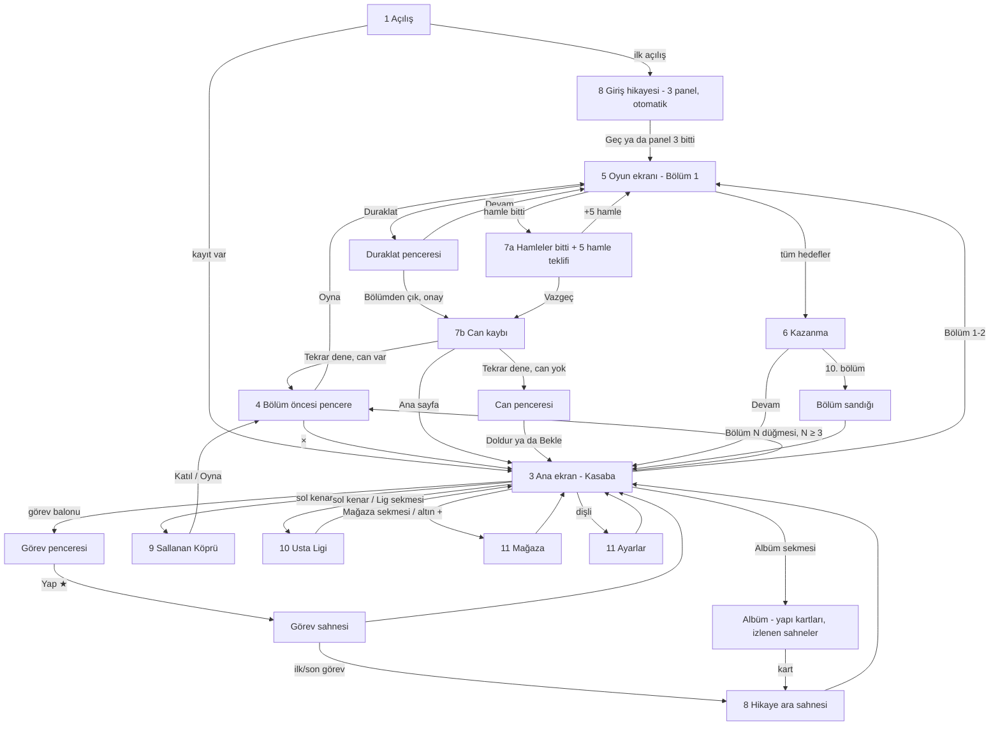

# UX akışları — Minik Usta

Sahip: design-lead · Durum: Faz 1 taslağı (2026-10-04) · Kaynak: `docs/BRIEF.md` §4, §8, §10, §11 · Görsel tarifler:
`docs/ART_DIRECTION.md` · Animasyonlar: `docs/JUICE.md` · Metinler: `docs/STORY.md` · Ölçüler: `src/theme/tokens.json`

---

## 0. Ölçü sistemi

### 0.1 Tasarım çözünürlüğü ve telefona eşleme

- Tasarım tuvali **1080×1920 px** (dikey). Tüm wireframe koordinatları bu tuvalde, sol üst (0, 0).
- **Telefona eşleme:** 375 pt genişlikte 1 pt = 2,88 px; 390 pt'de 1 pt = 2,77 px. Yani 1080 px genişlik = telefonun
  tam genişliği. Örnek: 120 px hücre = 41,7 pt (375) / 43,3 pt (390); 172 px güçlendirici yuvası = 60 / 62 pt.
- **44 pt kuralı:** en küçük dokunma hedefi 375 pt'de 44 pt = **128 px**. Token: `touch.minTarget = 128`. Görseli
  daha küçük olan öğeler (blok hücresi 120 px) görünmez **dokunma payı** (`touch.hitSlop = 12 px`) ile ≥ 144 px'e çıkar;
  iki hedefin payları çakışırsa dokunuş merkezine en yakın hücreye gider.
- **Uzun telefonlar (öneri P-4):** 390×844 gibi 19,5:9 ekranlarda FIT ölçekleme 1080×1920'yi 390×693 pt'ye sığdırır ve
  üstte/altta toplam 151 pt boş bant bırakır. Öneri: genişlik sabit 1080, yükseklik ekran oranına göre **1920–2400 px
  arasında uzar** (Phaser `Scale.EXPAND` ya da eşdeğeri; karar code-lead'in). Yerleşim çapaları: üst HUD üste, alt bar
  alta çapalı; tahta aradaki alanda dikey ortalanır; fazladan yükseklik arka planla dolar. Bu belgedeki wireframe'ler
  1920 yüksekliği gösterir; 2337 px'te (390×844) tahta 208 px aşağı kayar ve başparmak bölgesine yaklaşır.
- Güvenli alan (çentik): `index.html` oyun kabını `env(safe-area-inset-*)` ile içeri alıyor; tasarım tuvali zaten güvenli
  alanın içindedir. Ek olarak üstte 24 px, altta 24 px kenar boşluğu.

### 0.2 Başparmak bölgesi

```
 y=0    ┌──────────────────────────────┐
        │  ZOR ERİŞİM  (üst %30)       │  duraklat, geç, kapat (×) — bilinçli olarak zor:
 y=576  ├──────────────────────────────┤  yanlışlıkla basılmasın
        │  ESNEME  (%30–%55)           │  tahtanın üst satırları, vinç alanı (imza "yukarı" hareketi)
 y=1056 ├──────────────────────────────┤
        │  RAHAT  (alt %45)            │  Oyna, Devam, güçlendiriciler, alt navigasyon,
        │                              │  pencere birincil düğmeleri, +5 hamle, bloklar (alt satırlar)
 y=1920 └──────────────────────────────┘
```

Kural: her ekranın **birincil eylemi y ≥ 1400** (alt %27) ve en az 128 px yüksekliktedir. Kapat/Geç/Duraklat gibi
geri dönüşü olan ikincil eylemler üst köşelerde durabilir. Tahta istisnadır: imza hareket "yukarı" gerektirir;
blok parmağın 1,2 hücre üstünde göründüğü için parmak bloğun altında, daha rahat bölgede kalır.

### 0.3 Ortak kalıplar

| Kalıp | Tarif |
| ----- | ----- |
| Birincil düğme | yeşil, en az 560×160 px, 3B dudak 12 px, metin `font.size.button` (56 px) beyaz + kontur |
| İkincil düğme | turuncu, 400×144 px |
| Metin düğme | dolgusuz, `ui.inkSoft`, alt çizgi yok, dokunma alanı ≥ 128 px yükseklik |
| Kapat (×) | kırmızı daire Ø 112 px görsel + 16 px pay = 144 px hedef; pencerenin sağ üst köşesine 40 px taşar |
| Pencere | krem panel, kenar 12 px `panelEdge`, köşe 48 px, arkada `ui.overlay` %55; açılış 220 ms (JUICE) |
| Rozet | Ø 56 px kırmızı (#E8473B) daire, beyaz sayı ya da "!" |
| Kilitli öğe | %55 gri (`ui.disabled`) + asma kilit 64 px + açılış bölümü ("Bölüm 15"); dokununca 1,2 s ipucu balonu "Bölüm 15'te açılır" |
| Yükleniyor | bloklardan dönen mini vinç döngüsü (96 px) + 0,4 s gecikmeyle görünür (kısa yüklemede titreşim olmasın) |
| Hata | krem panel + Kepçe "kafası karışık" + kısa metin + "Tekrar dene"; kırmızı çarpı ve suçlayıcı dil yok |
| Boş durum | Kepçe kazıyor illüstrasyonu + tek satır açıklama + (varsa) eyleme götüren düğme |
| Geri | Android geri tuşu / tarayıcı geri = en üstteki pencereyi kapat; oyun ekranında = Duraklat penceresi |

---

## 1. Açılış (Splash / yükleme)

```
y    0 ┌────────────────────────────────────┐
       │            gökyüzü #7FD3F7          │
  300  │      ▣ ▣   bloklar yukarıdan       │  "MİNİK USTA" logosu 8 bloktan inşa olur
  420  │   ┌──────────────────────────┐     │  logo kutusu 880×360, merkez (540, 560)
       │   │  M İ N İ K   U S T A     │     │
  740  │   └──────────────────────────┘     │
  900  │        ☺ Tuna      🐕 Kepçe          │  Tuna kaskını düzeltir, Kepçe havlar (840×520 sahne)
 1420  │   ══════════════════════════      │  zemin çizgisi
 1560  │   ⌐▀▀▀▀▀▀▀▀▀▀▀▀▀▀▀▀▀▀▀▀▀▀▀▀▀▀▀¬     │  yükleme: vinç kolu 840 px; kanca bloğu soldan sağa taşır
 1640  │   [▣]──────────────▶               │  blok konumu = yükleme yüzdesi
 1840  │              v0.1.0  (34 px)       │
 1920  └────────────────────────────────────┘
```

| Öğe | Konum / boyut | Not |
| --- | ------------- | --- |
| Logo | 880×360, merkez (540, 560) | 8 blok (W Y G R O C B P) düşer ve "MİNİK USTA" yazısının arkasında kutuları oluşturur; yazı Baloo 2 800, 120 px |
| Tuna + Kepçe sahnesi | 840×520, merkez (540, 1160) | Tuna kaskını düzeltir (0,6 s), Kepçe havlar (0,4 s) |
| Yükleme vinci | 840×200, y 1540–1740 | taşınan blok x = 120 + 720 × yüzde |
| Sürüm | merkez (540, 1840), 34 px `ui.inkSoft` | — |

Durumlar:

- **Yükleniyor:** varsayılan. Animasyon en az 1,5 s (logo tamamlansın), yükleme bitince en fazla 0,3 s bekleyip geçer.
- **Hata (kayıt bozuk / doku üretimi başarısız):** vinç durur, panel "Bir şeyler takıldı. Yeniden deneyelim mi?" +
  "Tekrar dene" (y 1600). Kayıt bozuksa yedek kayıt yüklenir (code-lead), oyuncuya teknik ayrıntı gösterilmez.
- **Boş / kilitli:** yok.
- **Geri dönen oyuncu:** splash → Ana ekran (FTUE değilse).

---

## 2. İlk oturum (FTUE)

Akış: **Açılış → 3 panelli giriş hikayesi (otomatik ilerler, atlanabilir) → doğrudan Bölüm 1 → Kazanma → Ana ekran →
ilk yıldızı harcama → ilk ara sahne → Bölüm 2 düğmesi.** İlk oturumda bölüm öncesi pencere **gösterilmez** (Bölüm 1–2);
Bölüm 3'ten itibaren gösterilir (oyun öncesi güçlendiriciler 12'de açıldığı için 3–11 arası pencere sade).

### 2.1 "≤ 10 saniye ve ≤ 3 dokunuş" kanıtı

Ölçüm başlangıcı: uygulamanın ilk karesi (Capacitor'da native splash bitişi; web'de `DOMContentLoaded`). Bitiş: Bölüm 1
tahtasının etkileşime açıldığı kare.

| # | Adım | Süre (s) | Gerekli dokunuş | Kümülatif süre | Not |
| - | ---- | -------- | --------------- | -------------- | --- |
| 1 | Açılış animasyonu + yükleme | 2,0 (en az 1,5) | 0 | 2,0 | Yükleme paralel: font 38 KB, prosedürel dokular, `level_001.json`. Bütçe: orta telefonda ≤ 2,0 s. |
| 2 | Giriş paneli 1 (otomatik) | 1,8 | 0 | 3,8 | Her panel 1,8 s sonra kendiliğinden geçer; dokunmak hemen geçirir. |
| 3 | Giriş paneli 2 (otomatik) | 1,8 | 0 | 5,6 | |
| 4 | Giriş paneli 3 (otomatik) | 1,8 | 0 | 7,4 | |
| 5 | Geçiş (panel → tahta, 0,4 s) + Bölüm 1 tahtası açılır | 0,6 | 0 | **8,0** | Usta Dede balonu ve el animasyonu tahtayla aynı anda gelir. |

- **Dokunuş:** gerekli dokunuş **0**. Oyuncu panelleri dokunarak hızlandırırsa en fazla 3 dokunuş (her panel 1) ya da
  "Geç" ile **1 dokunuş**; her durumda ≤ 3. ✓
- **Süre:** dokunmadan 8,0 s; panelleri dokunarak geçen oyuncu ~4–5 s. Yükleme bütçesi 2,0 s'yi 2 s aşsa bile 10 s
  içinde kalır (açılış animasyonu yüklemeyi örter; paneller yükleme bitmeden başlamaz). ✓
- **Ses kilidi:** tarayıcılar sesi ilk kullanıcı dokunuşuna kadar engeller. İlk dokunuş (panel ya da blok) sesi açar;
  dokunmadan geçen oyuncu ilk bloğu tuttuğunda sesi duyar. Ayrı bir "Başlamak için dokun" ekranı **yok**.
- **Varsayım:** web sürümünde ilk ziyaret ağ indirmesi bu ölçümün dışındadır (paket boyutu bütçesi code-lead'in;
  öneri ≤ 1,5 MB gzip ilk yük). Kurulu uygulama ve tekrar ziyaret için yukarıdaki tablo geçerlidir.

### 2.2 FTUE adımları (Bölüm 1 sonrası)

| # | Ekran | Ne olur | Vurgu / el | Dokunuş |
| - | ----- | ------- | ---------- | ------- |
| 6 | Kazanma | Kısa kazanma gösterisi (≤ 3 s), yıldız ana ekrana uçar | "Devam" düğmesi nabız | 1 (Devam) |
| 7 | Ana ekran | İlk açılış: alt nav ve kenar ikonları gizli (yalnız üst çubuk, görev balonu, "Bölüm 2"). Yıldız sayacı 1'i gösterir | görev balonu (ünlemli) spot ışığında, el dokunma animasyonu | 1 (görev balonu) |
| 8 | Görev penceresi | "Ağaç evin merdivenini kur — ★1" | "Yap ★1" düğmesi | 1 |
| 9 | Görev sahnesi | Ağaç ev basamakları yükselir (2 s), Tuna sevinir | — | 0 |
| 10 | İlk ara sahne (Bölüm 1 başlangıç) | 4 panel (STORY: CH1-START) | dokununca ilerler, "Geç" | 1–4 |
| 11 | Ana ekran | Alt navigasyon **Bölüm 5'te**, kenar ikonları açıldıkça belirir (bkz. §3) | "Bölüm 2" düğmesi nabız | 1 |

İlk oturumun "önce oyun, sonra meta" sırası: ilk meta dokunuşu, ilk kazanmadan sonradır.

---

## 3. Ana ekran (Kasaba)

```
y    0 ┌────────────────────────────────────┐
   40  │ [♥ 5  29:12] [● 1.250 (+)] [★ 3]   │  üst çubuk h 112: can 300, altın 360, yıldız 240
  152  ├────────────────────────────────────┤
       │ ┌──┐                         ┌──┐ │  sol kenar: etkinlik ikonları 152×152, x 24
  420  │ │Kö│ 5s 12d                   │Gü│ │  (Sallanan Köprü + kalan süre rozeti)
  600  │ └──┘                         └──┘ │  sağ kenar: günlük ödül, kumbara, sandık, x 904
       │ ┌──┐   ~~ aktif yapı ~~      ┌──┐ │
  780  │ │Li│   (yarı inşa, paralaks) │Ku│ │  (Usta Ligi + sıra rozeti "#12")
  960  │ └──┘        ┌───────┐       └──┘ │
       │             │  (!)  │ görev    ┌──┐ │  görev balonu 200×200, yapı üstünde
 1140  │             │ ★1    │ balonu   │Sa│ │
       │             └───────┘          └──┘ │
 1320  │                                    │
 1440  │      [ZOR]  etiketi (varsa)        │  etiket 240×80, düğmenin sol üstüne taşar
 1480  │   ┌────────────────────────────┐   │
       │   │        BÖLÜM 12            │   │  birincil düğme 720×176, merkez (540, 1568)
 1656  │   └────────────────────────────┘   │
 1720  ├──────┬──────┬────────┬──────┬──────┤
       │Mağaza│ Lig  │  ANA   │Takım │Albüm │  alt nav h 176: 5 sekme × 216 px
       │  🛒  │  🏆  │  🏠    │ 🔒   │ 📖   │  ortadaki seçili sekme 24 px yükselir
 1896  └──────┴──────┴────────┴──────┴──────┘
```

| Öğe | Konum / boyut | Davranış |
| --- | ------------- | -------- |
| Can | (24, 40) 300×112 | Kalp + sayı + yenilenme sayacı (dolu ise "Dolu"). Dokun → Can penceresi (altınla doldur). |
| Altın | (348, 40) 360×112 | Sikke + sayı + yeşil (+) 80 px. Dokun → Mağaza. |
| Yıldız | (732, 40) 240×112 | Yıldız + sayı. Dokun → görev penceresi. |
| Ayarlar | (996, 52) 72×88 görsel + pay → 128 px | Dişli. Dokun → Ayarlar. |
| Sol kenar | x 24, 152×152, y 420 / 780 | Sallanan Köprü (Bölüm 15), Usta Ligi (Bölüm 25). Açılmadan önce gizli. |
| Sağ kenar | x 904, 152×152, y 420 / 780 / 1140 | Günlük ödül (2. gün), Kumbara (20), Bölüm sandığı (10; ilerleme halkası). |
| Görev balonu | 200×200, aktif yapının üstünde | Ünlem + yıldız maliyeti; yetecek yıldız varsa zıplar (2 s'de bir). |
| Bölüm düğmesi | 720×176, merkez (540, 1568) | "BÖLÜM 12". Zor: kırmızı "ZOR" etiketi; Çok Zor: mor "ÇOK ZOR" etiketi + düğme kenarında ince ikaz şeridi. |
| Alt navigasyon | y 1720–1896, 5 × 216 | Mağaza · Lig · **Ana Sayfa** · Takım (kilitli, "Yakında") · Albüm. Bölüm 5'ten önce gizli. |

Durumlar:

- **Boş:** yıldız 0 ve görev yok (hikaye bölümünün tüm görevleri bitti) → görev balonu yerine "Sonraki yapı Bölüm 21'de"
  rozeti.
- **Yükleniyor:** kasaba sahnesi hazır değilse (ilk geçişte ≤ 300 ms) gökyüzü + düğme hemen görünür, yapı belirerek gelir.
- **Hata:** etkinlik verisi üretilemezse ikon gri + "!" rozeti; dokununca "Etkinlik şu an hazır değil. Biraz sonra bak."
- **Kilitli:** kilitli kenar ikonları gösterilmez (sürpriz açılış); alt nav'da Takım kalıcı kilitli ("Yakında").
- **Can yok:** Bölüm düğmesi gri değil (oyuncu yine dokunabilir) → Can penceresi açılır: sayaç + "Altınla doldur" +
  "Bekle".
- **İçerik sonu (Bölüm 50 bitti):** düğme "Yeni bölümler yolda" (pasif) ya da "Usta Modu" (product-lead + entrepreneur
  kararına bağlı).

---

## 4. Bölüm öncesi pencere

```
y  300 ┌────────────────────────────────────┐ (×) 144 px hedef, köşe (1000, 300)
       │  ┌──────────────────────────────┐  │  panel 960×1280, x 60–1020
  360  │  │      BÖLÜM 12      [ZOR]     │  │  başlık h1 88 px
  480  │  ├──────────────────────────────┤  │
       │  │   ┌──────────┐  ┌───┐ ┌───┐ │  │  hedefler: yapı resmi 280×280 + ek hedefler 160×160
       │  │   │ Tezgâh   │  │▦×6│ │✦×5│ │  │
  800  │  │   └──────────┘  └───┘ └───┘ │  │
  860  │  │  Galibiyet serisi: ▰▰▱ (2)   │  │  seri göstergesi 760×100 (Bölüm 15+)
  980  │  │  ┌────┐  ┌────┐  ┌────┐      │  │  3 oyun öncesi güçlendirici yuvası 200×200
       │  │  │ 🧪 │  │ 🪣 │  │ ▤↑ │      │  │  seçilince yeşil çerçeve + ✓
 1180  │  │  └────┘  └────┘  └────┘      │  │
 1380  │  │  ┌────────────────────────┐  │  │
       │  │  │         OYNA           │  │  │  birincil 640×176, merkez (540, 1468)
 1556  │  │  └────────────────────────┘  │  │
 1580  └──┴──────────────────────────────┴──┘
```

| Öğe | Not |
| --- | --- |
| Başlık | "BÖLÜM 12" + zorluk etiketi (Kolay/Normal etiketsiz). |
| Hedef kutusu | Yapı parçasının küçük resmi (panoramadan render, adıyla: "Tezgâh"), ek hedefler sayaçlı ikon. |
| Galibiyet serisi | 3 basamaklı gösterge; seçili basamağın bonusu ikonla (Altın Mala / Termos). Bölüm 15 öncesi gizli. |
| Güçlendirici yuvaları | Termos (12), Mala Başlangıcı (16), Açık Kepenk (20). Adet rozeti; 0 ise "+" (altınla al). Dokun = seç/bırak. |
| Oyna | Seçili güçlendiriciler harcanır, oyun ekranına geçiş. |

Durumlar: **kilitli yuva** (açılış bölümü yazılı asma kilit) · **adet 0** ("+" → mini satın alma penceresi, altın
yetmezse Mağaza'ya yönlendirme) · **can yok** (Oyna yerine "Can bekleniyor 12:40" + "Doldur") · **yükleniyor** (yok;
bölüm verisi yereldir) · **hata** (bölüm JSON doğrulaması başarısız → "Bu bölüm hazırlanamadı" + Ana ekran; analytics
olayı).

---

## 5. Oyun ekranı

### 5.1 Düzen

```
y    0 ┌────────────────────────────────────┐
   40  │[II] ┌─panorama──────────────┐ ┌───┐│  duraklat 128×128 (24,40)
       │     │ ▣▣ ▣▣ ░░ ░░ ░░        │ │ 24 ││  panorama 592×110 (168,40)
  152  │     ├─hedefler──────────────┤ │hml││  hamle sayacı 280×224 (776,40)
       │     │ 🏠  ▦ 4/6   ✦ 2/5     │ │   ││  hedefler 592×104 (168,160)
  264  │     └───────────────────────┘ └───┘│
  288  │ · · · · · · · · · · · · · · · · · ·│  VİNÇ ALANI y=9  (288–408)
       │ · · · · · · · · · · · · · · · · · ·│  VİNÇ ALANI y=8  (408–528)
  528  │┌──────────────────────┐┃┌────────┐ │  ─ ─ ─ ─ kesik sınır çizgisi
       ││ ■ ■ ■ ■ ■ ■          │┃│ ▒  ▒   │ │  satır 7
       ││ ■ ■ ■ ■ ■ ■          │┃│ ▒  ▒   │ │  saha x 30–750 (6×120)
       ││ ■ ■ ■ ■ ■ ■          │ │ ▒  ▒   │ │  duvar x 750–810 (60), geçit = boşluk
       ││ ■ ■ ■ ■ ■ ■          │┃│ ▒  ▒   │ │  şantiye x 810–1050 (2×120)
       ││ ■ ■ ■ ■ ■ ■          │┃│ ▒  ▒   │ │
       ││ ■ ■ ■ ■ ■ ■          │┃│ ▒  ▒   │ │
       ││ ■ ■ ■ ■ ■ ■          │┃│ ▒  ▒   │ │
 1488  │└──────────────────────┘┃└────────┘ │  satır 0
 1504  │ Usta Serisi ●●●○ [mala]  🚚 Kamyonda:3│  durum şeridi h 96
 1600  ├────────────────────────────────────┤
       │ ☺🐕     ┌────┐┌────┐┌────┐┌────┐   │  Tuna+Kepçe 280×296 (16,1600)
       │ Tuna    │ 🔨 ││ 🪝 ││ 🖌 ││ ↶  │   │  güçlendirici yuvaları 172×172, x 314–1056
       │ Kepçe   │ 2  ││ 1  ││ 🔒 ││ +  │   │  y 1660–1832
 1896  └─────────┴────┘└────┘└────┘└────┘───┘
```

Tahta: hücre `c` = 120 px; satır y (0 = en alt) → ekran üst kenarı `1488 − 120·(y+1)`; sütun x (0–5) → `30 + 120·x`,
şantiye sütunu x (6–7) → `810 + 120·(x−6)`. Vinç alanı y=8–9 tahtanın üstünde, aynı sütun ızgarası. Tahta genişliği
1020 px (ekranın %94'ü).

| Öğe | Davranış |
| --- | -------- |
| Duraklat | Duraklat penceresi: Devam (birincil), Ses/Müzik/Titreşim anahtarları, "Bölümden çık" (onay ister: "Çıkarsan 1 can gider."). |
| Panorama | Planın tamamının küçük önizlemesi; dilimler 2 sütunluk sütunlar halinde, aktif dilim beyaz çerçeveli, tamamlananlar renkli, gelecekler gri çizgi. Dokun → 1,5 s büyük önizleme (oyun durmaz, hamle harcanmaz). |
| Hedefler | `build` için yapı ikonu + dilim sayacı ("2/4"), `clear` / `collect` sayaçları. Hedef tamamlanınca ✓ ve yeşil. |
| Hamle sayacı | Baloo 2 800, 120 px. Son 5 hamlede kırmızı nabız (JUICE). |
| Usta Serisi | 4 boncuk; dolunca Altın Mala ikonu parlar ve "dokun, kullan" durumuna geçer (seçim: plandaki boş hücreye dokun). |
| Kamyon göstergesi | Kuyrukta blok varsa görünür: "Kamyonda: 3" (K-26); yoksa gizli. |
| Tuna + Kepçe | Etkileşimsiz tepki karakterleri (doğruda sevinç, hatalıda yüz buruşturma, komboda dans). Dokunulursa tek bir el sallama (işlevsiz). |
| Güçlendiriciler | Çekiç (8), Vinç (10), Boya Fırçası (22), Geri Al (13). Adet rozeti; 0 → "+" mini satın alma. Kilitli → asma kilit + bölüm no. |

Durumlar: **ilk yükleme** (tahta 400 ms içinde bloklar yukarıdan yerine düşer; etkileşim bu animasyon bitince açılır)
· **kilitlenme** (K-30: "Kamyon Yardımı" balonu + karıştırma, JUICE) · **hamle bitti** (Kaybetme penceresi) ·
**duraklatma** (uygulama arka plana atılınca otomatik) · **hata** (beklenmeyen durum: oyun kaydı alınır, "Bölümü baştan
başlat" teklif edilir, can gitmez).

### 5.2 Güçlendirici kullanım akışı

1. Yuvaya dokun → yuva yükselir, tahta üstünde ince açıklama şeridi ("Kırmak için bir bloğa dokun") + "Vazgeç" (×).
2. Hedef seçimi: Çekiç = blok ya da engel; Vinç = blok seç, sonra hedef konum (sürükle; döndürme için blok üstünde 2
   döndürme oku 112 px); Boya Fırçası = blok seç → 8 renk seçici (alt yarıda, her renk 112 px + sembol); Geri Al =
   anında uygular (seçim yok).
3. Uygulama animasyonu (JUICE) → adet −1. Vazgeçilirse adet düşmez.

### 5.3 Sürükleme hissi (tasarım ilkesi 4)

| Parametre | Değer | Token |
| --------- | ----- | ----- |
| Sürükleme başlangıcı | parmak 8 px hareket **ya da** 100 ms basılı | `drag.startThresholdPx`, `drag.holdMs` |
| Kaldırma | ölçek 1,00 → 1,08 (80 ms, easeOutBack), gölge belirir | `drag.liftScale` |
| Parmak ofseti | blok, tutulan hücresinin merkezi parmağın **1,2 hücre (144 px) üstünde** olacak şekilde 90 ms'de yukarı kayar | `drag.fingerOffsetCells` |
| Takip | blok her karede parmak + ofset konumuna **yumuşatmasız** gider (tek kare gecikme şartı). Mantıksal konum hücreye yuvarlanır, görsel konum süreklidir. | — |
| Eğim | yatay hıza göre ±4° (en fazla), 120 ms'de sönümlenir | `drag.tiltMaxDeg` |
| Yapışkan takip (K-08) | parmak ulaşılamaz yere giderse blok en yakın ulaşılabilir konumda kalır; ayrılık > 0,5 hücre ve > 150 ms ise bloktan parmağa noktalı **ip** (beyaz %60, 6 px) çıkar ve blok parmağa doğru 3° yaslanır | `drag.tetherDelayMs` |
| Çarpma | yapışkan takip bir engele dayandığında blok o yöne 6 px esneyip geri gelir (JUICE: "takip engele çarptı") | — |
| Bırakma (sahada) | hücreye 90 ms easeOutQuad oturma, ölçek 1,08 → 1,00 | — |
| Bırakma (şantiye üstü) | düşüş (K-11) | JUICE |
| Bırakma (geçerli değil) | başlangıç yerine 220 ms kavisle dönüş, hamle harcanmaz (K-07) | — |
| Tıklama (sürüklemeden) | blok 1 hücrelik zıplama (120 ms) + hafif haptik; hiçbir şey olmaz | — |
| Taşınamayan blok | dokununca 2 px sağ-sol titreme (3 döngü, 180 ms) + engelin (zincir, ıslak beton, üstünde blok) 300 ms vurgusu; hamle harcanmaz | — |
| Çoklu dokunuş | ikinci parmak yok sayılır (`activePointers: 2` ama sürükleme tek parmak) | — |

### 5.4 Düşüş gölgesi (K-18)

Blok şantiyenin üstündeyken (duvar üstünden ya da vinç alanından geçmiş) iniş konumu **her zaman** gösterilir; rüzgâr
(W8) ve balon (S8) dahil gerçek sonuç hesaplanır.

| Durum | Kolay / Normal | Zor / Çok Zor |
| ----- | -------------- | ------------- |
| Gölge gövdesi | bloğun hücreleri, iniş hücrelerinde: blok rengi %25 + 6 px kontur | aynı |
| Doğru yerleşim | **düz** 6 px kontur `ui.ghostValid` #5CF59A + dış parlama 8 px %40 + sağ üstte Ø 44 px beyaz rozet içinde ✓ | **kesik** 5 px beyaz %60 kontur, rozet yok |
| Hatalı yerleşim | **kesik** 8 px kontur `ui.ghostInvalid` #FF4A3D (16/10), 2 Hz nabız + Ø 44 px rozet içinde "!" ; uyuşmayan hücrelerde 45° tarama | **kesik** 5 px beyaz %60 kontur (doğrudan ayırt edilemez) |
| Düşüş yolu | bloktan gölgeye dikey noktalı çizgi (beyaz %35, 8/12) | aynı |
| Rüzgâr sapması | düşüş yolu 1 sütun kayan kavis + uçta küçük rüzgâr oku | aynı |
| Cam kırılacak | gölge rozetinde çatlak cam işareti (Ø 44, beyaz) — fizik bilgisi olduğu için tüm zorluklarda | aynı |
| Balon | gölge yukarıda (yükselme sonu) + ip simgesi | aynı |
| Ray (K-12) | blok raydayken gölge yok; blok bulunduğu yerde kalacağı için kontur doğrudan bloğun üstünde gösterilir (doğru/hatalı kuralı aynı) | aynı |

Renk körlüğü: doğru/hatalı yalnız renkle değil **çizgi deseni** (düz/kesik), **rozet** (✓/!) ve **nabız** ile
ayrışır; iki rengin açıklık farkı da büyüktür (L\* 87 / 58).

---

## 6. Kazanma

```
y    0 ┌────────────────────────────────────┐
  160  │      ✨  KAZANDIN!  ✨               │  başlık display 120 px
  360  │  ┌──────────────────────────────┐  │
       │  │   tamamlanan yapı parçası    │  │  yapı 720×720, son kez parlar
       │  │   (kurdele kesilir)          │  │  Bay Kurdele makasla kurdeleyi keser
 1080  │  └──────────────────────────────┘  │
 1140  │   Bonus İnşaat:  +7 hamle → ● 70    │  kalan hamleler tek tek altına dönüşür
 1260  │   ★ +1      ● +120                  │  ödül satırı
 1420  │   ☺🐕 dans                           │
 1600  │   ┌────────────────────────────┐   │
       │   │          DEVAM             │   │  birincil 640×176, merkez (540, 1688)
 1776  │   └────────────────────────────┘   │
 1920  └────────────────────────────────────┘
```

Sıra: dilimler son kez parlar (400 ms) → kurdele kesilir (600 ms) → konfeti → Bonus İnşaat (her kalan hamle 120 ms, en
fazla 2,4 s; dokununca hızlanır) → ödüller → "Devam" (Bonus İnşaat bitince ya da dokununca belirir). "Devam" → Ana ekran;
yıldız üst çubuktaki sayaca uçar. Bölüm sandığı dolduysa (her 10 bölüm) önce sandık açılır.

Durumlar: **etkinlik ilerlemesi** (Sallanan Köprü aktifse "Tahta 4/7" satırı eklenir; Lig puanı "+2 puan").
**Boş / hata / kilitli:** yok.

---

## 7. Kaybetme

**Pencere 1 — "Hamleler bitti!"**

```
y  420 ┌────────────────────────────────────┐ (×)
       │        HAMLELER BİTTİ!             │  h1
  560  │   ┌──────────────┐                 │
       │   │ kalan hedef  │  ▒▒ 2 hücre      │  eksik kalan: "2 hücre kaldı", "Kasa ×1"
  860  │   └──────────────┘                 │
  940  │   ☺ Tuna kararlı: "Az kaldı!"        │
 1180  │  ┌──────────────────────────────┐  │
       │  │  +5 HAMLE    ● 900           │  │  birincil (turuncu-altın) 760×176, merkez (540, 1268)
 1356  │  └──────────────────────────────┘  │
 1400  │  [▶ Reklam izle +5] (MVP yer tutucu)│  ikincil 560×128
 1560  │        Vazgeç                       │  metin düğme 400×128
 1640  └────────────────────────────────────┘
```

**Pencere 2 — can kaybı:** "Bir can gitti" + kalp kırılmaz, **söner** (gri, 400 ms) + galibiyet serisi sıfırlandı
satırı (seri > 0 ise) + "Tekrar dene" (birincil, y 1500) + "Ana sayfa" (metin). Sallanan Köprü'de: Tuna simitle kıyıya
yüzer (STORY) + "Köprüden düştün, ama bir dahaki sefere!".

Durumlar: **altın yetmez** (birincil düğme "Altın al" → Mağaza, dönüşte pencere açık kalır) · **can 0** (Tekrar dene →
Can penceresi) · **etkinlik** (Sallanan Köprü'de "+5 hamle elenmeyi önler" satırı; entrepreneur etik notuna bağlı).

---

## 8. Hikaye ara sahnesi

```
y    0 ┌────────────────────────────────────┐
   40  │                         [ GEÇ ▶▶ ] │  Geç 240×128 (816,40) — bilinçli olarak üst köşede
  200  │  ┌──────────────────────────────┐  │
       │  │                              │  │  panel 1000×1000, 18 px koyu kontur, köşe 24
       │  │       çizgi roman paneli     │  │  panel giriş: 280 ms kayma + hafif dönme
       │  │                              │  │
 1200  │  └──────────────────────────────┘  │
 1240  │   ╭─────────────────────────────╮  │  konuşma balonu: maks. 900×360, body 44 px
       │   │ Tuna: "Dede, bu tabela      │  │  konuşan karakterin yüz ikonu 120 px balonun solunda
       │   │  bizim mi?"                 │  │
 1600  │   ╰────────────────────────────╯   │
 1760  │         ● ● ○ ○   (panel noktaları) │  ilerleme noktaları
 1840  │            dokun ▸                   │  1,5 s dokunulmazsa "dokun" ipucu belirir
 1920  └────────────────────────────────────┘
```

- Dokunuş (Geç dışında herhangi bir yer) → balon tamamlanmamışsa metni tamamlar; tamamlanmışsa sonraki panel.
- Metin daktilo hızı 40 karakter/s; "animasyonları azalt" açıkken anında.
- FTUE giriş sahnesi (3 panel) **otomatik** ilerler (her panel 1,8 s); diğer sahneler dokununca ilerler.
- Bölüm sonu sahnesinin son paneli "Albüme eklendi" kartıyla kapanır.

Durumlar: **yükleniyor** (panel görseli hazır değilse yer tutucu SVG ile oynar — sahne asla bekletmez) · **hata**
(sahne verisi yoksa atlanır, analytics) · **kilitli** (Albüm'de izlenmemiş sahne: gri kart + "Kasabada 3 görev daha").

---

## 9. Sallanan Köprü

```
y    0 ┌────────────────────────────────────┐
   40  │ [←]   SALLANAN KÖPRÜ     ⏱ 5s 12d  │  geri 128×128; başlık h2; geri sayım
  200  │   Ödül havuzu: ● 10.000             │
  320  │   Köprüde kalan: 47 / 100           │  canlı sayaç (display 120 px rakam)
  480  │  ┌──────────────────────────────┐  │
       │  │ kıyı ═╤═╤═╤═╤═╤═╤═╤═ kıyı    │  │  7 tahtalı köprü 1000×520, sallanır
       │  │      1 2 3 4 5 6 7  ⛿ ödül    │  │  oyuncunun kaskı (Tuna) büyük, diğerleri küçük kask
       │  │  ~~~~ nehir, simitli düşenler~ │  │
 1000  │  └──────────────────────────────┘  │
 1060  │   Sen: 3. tahtadasın (Tuna kaskı)    │
 1200  │   Kurallar: 7 bölümü art arda kazan │  3 satır, body 44 px
 1560  │   ┌────────────────────────────┐   │
       │   │   KATIL / BÖLÜM 18'İ OYNA  │   │  birincil 720×176
 1736  │   └────────────────────────────┘   │
 1920  └────────────────────────────────────┘
```

Durumlar: **katılmadı** (birincil "Katıl"; köprü boş, 100 kask kıyıda) · **aktif** ("Bölüm N'yi oyna") · **elendi**
(oyuncunun kaskı simitle kıyıda; "Bir sonraki köprü: 3s 20d") · **kazandı** (ödül pay animasyonu + "Topla") ·
**bekleme** (geri sayım, gri köprü) · **kilitli** (Bölüm 15 öncesi; ana ekranda görünmez, Albüm'den/derin bağlantıdan
gelinirse "Bölüm 15'te açılır") · **hata** (bot simülasyonu üretilemezse "Köprü bakımda" + Ana ekran).

---

## 10. Usta Ligi

```
y    0 ┌────────────────────────────────────┐
   40  │ [←]   USTA LİGİ          ⏱ 3g 4s    │
  200  │   ┌─────┐  GÜMÜŞ MALA ligi          │  lig rozeti 200×200
       │   │ 🏆  │  İlk 20 terfi, son 20 düşer│
  420  │   └─────┘                           │
  460  │  ┌──────────────────────────────┐  │  liste 1000×1200, satır 120 px
       │  │ 1  🎁 Selin_U     42 puan     │  │  ilk 3 sandık ikonu
       │  │ 2  🎁 …                       │  │
       │  │ …                             │  │
       │  │ 20 …          ▲ TERFİ ÇİZGİSİ │  │  yeşil kesik çizgi 6 px
       │  │ …                             │  │
       │  │ 81 …          ▼ DÜŞME ÇİZGİSİ │  │  turuncu kesik çizgi 6 px (kırmızı değil)
 1660  │  └──────────────────────────────┘  │
 1680  │  ┃12 ☺ Sen      18 puan ┃ (yapışık)│  oyuncu satırı alta yapışık 1000×136, vurgulu
 1840  │   Puan: Kolay/Normal 1 · Zor 2 · Çok Zor 3 │
 1920  └────────────────────────────────────┘
```

Durumlar: **kilitli** (Bölüm 25) · **katılım bekliyor** (yeni haftanın ilk galibiyetinde gruba girilir: "İlk galibiyetinle
lige katıl") · **hafta bitti** (sonuç penceresi: terfi/kal/düş + ödül) · **boş liste** (yok; bot grubu her zaman 100) ·
**yükleniyor** (liste iskeleti 6 gri satır) · **hata** ("Lig tablosu hazırlanamadı" + Tekrar dene).

---

## 11. Mağaza ve Ayarlar

**Mağaza**

```
y    0 ┌────────────────────────────────────┐
   40  │ [←]  MAĞAZA         [● 1.250]       │
  200  │  ┌──────────────────────────────┐  │  başlangıç paketi kartı 1000×420 (bir kez)
       │  │ Başlangıç Paketi  ● 2.000 +🔨2 │  │  "sahte satın alma" rozeti (MVP, geliştirici modu)
  620  │  └──────────────────────────────┘  │
  680  │  ┌──────┐ ┌──────┐ ┌──────┐       │  altın paketleri 3 sütun × 2 satır, kart 312×360
       │  │ ●500 │ │●1200 │ │●2600 │       │
       │  └──────┘ └──────┘ └──────┘       │
       │  ┌──────┐ ┌──────┐ ┌──────┐       │
 1460  │  └──────┘ └──────┘ └──────┘       │
 1500  │  ┌──────────────────────────────┐  │  kumbara kartı (Bölüm 20+) 1000×240
 1740  │  └──────────────────────────────┘  │
 1920  └────────────────────────────────────┘
```

Fiyat metinleri `BUSINESS.md`'den (entrepreneur). Satın alma onayı: "Bu bir deneme satın alımıdır, ücret alınmaz."
Durumlar: **yükleniyor** (mağaza ürünleri yereldir; Capacitor'da mağaza fiyatları gelene kadar fiyat yerine "…") ·
**hata** ("Satın alma tamamlanamadı. Hesabından para çekilmedi." + Tamam) · **boş** (başlangıç paketi alındıysa kart
gizlenir) · **kilitli** (kumbara Bölüm 20).

**Ayarlar**

```
y    0 ┌────────────────────────────────────┐
   40  │ [←]  AYARLAR                         │
  200  │  Ses              [■■■■□] / [AÇIK]  │  her satır 1000×152, anahtar 176×96 (görsel) + pay
  360  │  Müzik            [AÇIK]            │
  520  │  Titreşim         [AÇIK]            │
  680  │  Dil              [Türkçe ▾]        │  TR / EN
  840  │  Renk körü modu   [KAPALI]          │  ART_DIRECTION §10
 1000  │  Animasyonları azalt [KAPALI]       │  JUICE "azaltılmış hareket" sütunu
 1160  │  Sol el modu      [KAPALI]          │  öneri: güçlendirici çubuğu ve Tuna köşesi yer değiştirir
 1320  │  Destek  ›                          │  e-posta / SSS
 1480  │  Lisanslar  ›                       │  OFL (Baloo 2), ZzFX vb.
 1640  │  Kaydı sıfırla  ›                   │  2 adım onay
 1840  │  Sürüm 0.1.0 · Oyuncu kimliği 7F3A…  │  caption
 1920  └────────────────────────────────────┘
```

- "Animasyonları azalt" ilk açılışta işletim sisteminin `prefers-reduced-motion` ayarından başlar.
- "Kaydı sıfırla": 1. pencere "Tüm ilerleme silinecek." → 2. pencere "Emin misin? Geri alınamaz." + 3 s bekleyen
  "Sıfırla" düğmesi.
- Durumlar: **hata** (ayar kaydedilemedi → anahtar eski hâline döner, 1,5 s bilgi balonu) · **boş / kilitli / yükleniyor**
  yok.

---

## 12. Ekranlar arası akış



Menü derinliği: Ana ekrandan her yere en fazla 2 dokunuş; oyun ekranına 1 (Bölüm 1–2) ya da 2 dokunuş.

---

## 13. Öğreticiler (yeni mekanik sırasıyla)

### 13.1 Öğretici dili

- **El:** Tuna'nın sarı iş eldiveni (140×160 px, `ui` konturu). Hareketler: `tap` (eldiven 0,9× basılır, 1,0× kalkar,
  halka dalgası), `drag(yol)` (yol boyunca 1,2 s, arkasında beyaz %60 noktalı iz; 0,4 s bekle; tekrarla), `hold` (basılı
  0,6 s). El, oyuncunun gerçek dokunuşunu engellemez; oyuncu ilk doğru dokunuşu yapınca el kaybolur.
- **Spot ışığı:** ekran `ui.overlay` %60 ile kararır; hedef(ler) yuvarlak dikdörtgen deliklerle açılır (12 px pay,
  6 px beyaz nabızlı kenar, 1,2 s). **Zorunlu adımda** delik dışındaki dokunuşlar yok sayılır; **yumuşak adımda**
  karartma %30 ve her yer dokunulabilir.
- **Usta Dede balonu:** ekranın üst yarısında (hedefi kapatmayacak yerde), büst 200 px + balon maks. 760×280,
  `font.size.body`. Metin kimliği `tut.l{bölüm}.{konu}`; metinler `STORY.md` §6'da (TR ≤ 8 kelime).
- **Tahta sadeliği:** her öğretici bölümde tahta, yeni mekaniği gösteren tek bir net hamle içerir (bölüm tasarımı
  product-lead'in; öğretici adım verisi `LevelData.tutorial`).
- **Vurgu kimlikleri** (`highlight` alanı için önerilen söz dağarcığı): `piece:<i>` (partideki i. blok), `cell:x,y`,
  `gap:<i>`, `wall`, `crane`, `build`, `panorama`, `goals`, `moves`, `truck`, `streak`, `booster:<hammer|crane|brush|undo>`,
  `pre:<thermos|trowel|shutter>`, `obstacle:<i>`, `fan`.

### 13.2 Öğretici tablosu

Z = zorunlu adım, Y = yumuşak adım. "Tamam koşulu" gerçekleşince sonraki adım. Satırlar 50 bölümlük plandaki ilk görünüş
sırasıyla.

| Bölüm | Mekanik | Adım | Vurgu | El animasyonu | Usta Dede satırı | Tamam koşulu |
| ----- | ------- | ---- | ----- | ------------- | ---------------- | ------------ |
| 1 | Kaldır–taşı–indir | 1 Z | `piece:0` + `crane` | drag: blok → yukarı vinç alanına → sağa duvar üstü → şantiye üstü (yay biçimli yol) | `tut.l1.lift` | blok duvar üstünü geçti |
| 1 | Düşme | 2 Z | `build` (hedef sütun) | parmak kalkma animasyonu (eldiven açılır) | `tut.l1.drop` | blok şantiyeye düştü |
| 1 | Plan eşleşmesi | 3 Y | `piece:1` + eşleşen plan hücreleri | drag yolu, sonra plan hücresine tap | `tut.l1.match` | 2. doğru yerleşim |
| 2 | Renk örüntüsü | 1 Y | `panorama` + plan şeritleri | plan satırları boyunca yatay süpürme | `tut.l2.pattern` | 1 doğru yerleşim |
| 2 | Düşüş gölgesi | 2 Y | şantiye üstündeki gölge | hold: blok şantiye üstünde tutulur, gölge yeşil/kırmızı değişir | `tut.l2.shadow` | oyuncu bir bloğu şantiye üstünde ≥ 0,5 s tuttu |
| 3 | Sabit geçit + ray (W1) | 1 Z | `gap:0` + blok | drag: yatay, geçitten şantiyeye | `tut.l3.gap` | blok geçitten geçti |
| 3 | Ray tutar | 2 Y | şantiyedeki raydaki blok | tap bloğa (iskele parlar) | `tut.l3.rail` | blok bırakıldı |
| 4 | Plan boşluğu (S2) | 1 Y | `.` hücreleri | hücreler üzerinde tap | `tut.l4.window` | — (2,5 s sonra) |
| 4 | Boşluğun üstü | 2 Z | `gap:0` + `.` hücresinin üstü | drag: geçitten raydan geçip boşluğun üstüne | `tut.l4.above` | boşluğun üstü dolduruldu |
| 5 | Kayan şantiye (S1) | 1 Y | `panorama` (2. dilim) | panoramada sağa ok | `tut.l5.segments` | ilk dilim bitti |
| 5 | Kamyon | 2 Y | `truck` + sahadaki yeni bloklar | yok (kamyon animasyonu kendisi) | `tut.l5.truck` | teslimat bitti |
| 6 | Yüksek duvar (W2) | 1 Z | `crane` + `wall` | drag: blok → en üste (y=9) → sağa → şantiye | `tut.l6.crane` | blok vinç alanından geçti |
| 7 | Kazı (K-10) | 1 Z | gömülü hedef blok + üstündeki blok + boş saha hücresi | drag: üstteki blok sahada boş yere | `tut.l7.dig` | sahada yeniden konumlandırma yapıldı |
| 7 | Kazı sonrası | 2 Y | serbest kalan blok | tap | `tut.l7.free` | — |
| 8 | Ağır malzeme (Y5) | 1 Y | ağır blok | tap ağır bloğa (blok titrer, ağırlık rozeti) | `tut.l8.heavy` | — (2,5 s) |
| 8 | Çekiç açıldı | 2 Z | `booster:hammer` → ağır blok | tap yuvaya, tap bloğa | `tut.l8.hammer` | Çekiç kullanıldı (ücretsiz deneme) |
| 9 | Dar geçit (W3) | 1 Z | `gap:0` + 1 satırlık blok | drag: yatay Lento (D2_90) geçitten | `tut.l9.narrow` | blok geçti |
| 10 | Vinç açıldı | 1 Z | `booster:crane` → blok → hedef | tap yuva, tap blok, drag hedefe, döndürme okuna tap | `tut.l10.crane` | Vinç kullanıldı |
| 11 | Ahşap kasa (Y1) | 1 Y | `obstacle:0` + komşu blok | drag komşu bloğu → kasa çatlar | `tut.l11.crate` | ilk kasa katı kırıldı |
| 12 | Temizleme hedefi | 1 Y | `goals` (kasa sayacı) | goals üstünde tap | `tut.l12.clear` | — (2 s) |
| 12 | Termos açıldı | 2 Y | `pre:thermos` (bölüm öncesi pencerede) | tap yuvaya | `tut.l12.thermos` | yuva seçildi ya da Oyna |
| 13 | Kepenk (W4) | 1 Y | `gap:0` + sayaç rozeti | tap rozete | `tut.l13.shutter` | 1 hamle yapıldı |
| 13 | Geri Al açıldı | 2 Y | `booster:undo` | tap | `tut.l13.undo` | — (ilk hatalı yerleşimde de tetiklenir) |
| 14 | Saha yerçekimi (Y6) | 1 Z | alttaki blok + üstündeki sütun | drag alttaki bloğu çıkar → üsttekiler düşer | `tut.l14.gravity` | zincirleme düşüş oldu |
| 15 | Ağır yerçekimi (G-H) | 1 Y | `build` + zaman çubuğu (700 ms) | drag: hızlıca şantiye üstüne | `tut.l15.heavyfall` | ilk iniş |
| 15 | Galibiyet serisi + Sallanan Köprü | — | Ana ekranda kenar ikonu | tap | `tut.meta.bridge` | ekran açıldı |
| 16 | Kayar kapı (W5) | 1 Y | `gap:0` + ▲▼ rozeti | 1 hamle bekle, kapının kayışı gösterilir | `tut.l16.slider` | 1 hamle yapıldı |
| 16 | Mala Başlangıcı açıldı | 2 Y | `pre:trowel` | tap | `tut.l16.trowel` | — |
| 17 | Moloz (S4) | 1 Z | `obstacle:0` (moloz) + saha boşluğu | drag molozu sahaya | `tut.l17.debris` | moloz taşındı |
| 18 | Çimento torbası (Y2) | 1 Y | torba + komşu blok | drag komşu → torba yırtılır | `tut.l18.bag` | torba gitti |
| 19 | Altın vida (Y7) | 1 Y | vida ışıltısı + üstündeki blok | drag üstteki bloğu kaldır | `tut.l19.screw` | ilk vida toplandı |
| 20 | Açık Kepenk açıldı | 1 Y | `pre:shutter` | tap | `tut.l20.openshutter` | — |
| 20 | Kumbara | — | Ana ekran sağ kenar | tap | `tut.meta.piggy` | — |
| 21 | Cam blok (S3) | 1 Y | cam blok + gölgedeki çatlak rozeti | hold: blok yükseğe kaldırılınca çatlak rozeti belirir | `tut.l21.glass` | ilk cam blok sağlam indi |
| 22 | Boya kapısı (W6) | 1 Z | `gap:0` (renkli damla) + blok | drag: blok geçitten geçer, renk değişir | `tut.l22.paint` | blok boyandı |
| 22 | Boya Fırçası açıldı | 2 Y | `booster:brush` | tap yuva → blok → renk | `tut.l22.brush` | kullanıldı ya da atlandı |
| 23 | Hafif yerçekimi (G-L) | 1 Z | düşen blok + yan sütun | düşerken bloğa tap → 1 sütun kayar | `tut.l23.steer` | kaydırma yapıldı |
| 24 | Zincir (Y3) | 1 Y | zincirli blok + komşusu | drag komşu → zincir kopar | `tut.l24.chain` | zincir koptu |
| 25 | Usta Ligi açıldı | — | Ana ekran sol kenar | tap | `tut.meta.league` | — |
| 26 | Kilitli geçit (W7) | 1 Y | `gap:0` (kilit) + anahtarın köşe ışıltısı | drag anahtarın üstündeki bloğu kaldır | `tut.l26.key` | anahtar alındı, kilit açıldı |
| 27 | Gizli plan — tekrar (S7) | 1 Y | `panorama` (1. dilim) + `?` hücreleri | panoramadan şantiyeye kopya oku | `tut.l27.repeat` | ilk `?` doğru dolduruldu |
| 28 | Islak beton (Y4) | 1 Y | ıslak blok sayacı | tap sayaç | `tut.l28.wet` | 1 hamle |
| 29 | Gizli plan — ayna (S7) | 1 Y | `panorama` (1. ve 2. dilim) | ayna çizgisi + simetrik ok | `tut.l29.mirror` | ilk `?` doğru dolduruldu |
| 31 | Döner platform (S5) | 1 Y | `build` + dönme sayacı (4) | dönen dilimler üstünde kavis oku | `tut.l31.carousel` | ilk dönüş |
| 32 | Rüzgâr fanı (W8) | 1 Z | `fan` + gölgedeki sapma | hold: 1 geniş blok şantiye üstünde, kayan gölge | `tut.l32.wind` | rüzgârlı iniş |
| 35 | Harçlı blok (Y8) | 1 Y | harçlı blok | tap mala rozetine | `tut.l35.mortar` | — (2,5 s) |
| 37 | Asansör iskele (S6) | 1 Y | `build` çerçevesi + geçit | 1 hamle bekle, çerçeve 1 satır kayar | `tut.l37.elevator` | 1 hamle |
| 38 | Balonlu blok (S8) | 1 Z | balonlu blok + üstteki tutucu | drag şantiyeye, bırak → yükselir | `tut.l38.balloon` | balonlu blok yerleşti |

**Bağlamsal öğreticiler** (bölüm değil, ilk gerçekleştiği an; bir kez):

| Tetik | Vurgu | Satır |
| ----- | ----- | ----- |
| Usta Serisi ilk kez 3/4 | `streak` | `tut.ctx.streak` |
| Altın Mala ilk kez kazanıldı | `streak` → plan boş hücresi | `tut.ctx.goldtrowel` |
| İlk hatalı yerleşim | geri seken blok | `tut.ctx.bounce` |
| Son 5 hamle ilk kez | `moves` | `tut.ctx.lastmoves` |
| Kamyon kuyruğu ilk kez (K-26) | `truck` | `tut.ctx.queue` |
| İlk kilitlenme (K-30) | saha | `tut.ctx.reshuffle` |
| İlk taşınamayan bloğa dokunma | blok | `tut.ctx.blocked` |
| Bölüm sandığı ilk dolum (10) | sandık | `tut.meta.chest` |
| Günlük ödül ilk gün (2. gün) | sağ kenar | `tut.meta.daily` |
| Mağaza açılışı (5) | alt nav | `tut.meta.shop` |

---

## 14. Erişilebilirlik özeti

- Dokunma hedefi ≥ 128 px (≈ 44 pt @375); bloklarda 12 px dokunma payı.
- Renk asla tek taşıyıcı değil: blok sembolleri, geçit siluetleri, gölge çizgi deseni + rozet.
- Animasyonları azalt: JUICE "azaltılmış hareket" sütunu; ekran sallama yok, parçacıklar ≤ %20.
- Metin en küçük 34 px (≈ 12 pt); kontrast ≥ 4,5:1 (krem üstünde koyu metin 12,5:1).
- Süre baskısı yalnız ağır yerçekiminde (700 ms, K-19); bu bölümlerde "animasyonları azalt" süreyi değiştirmez (oyun
  kuralı), ama zaman çubuğu görseli her zaman gösterilir.
- Sol el modu (öneri, P-6): Tuna köşesi ile güçlendirici çubuğu yer değiştirir; tahta aynalanmaz (saha solda kalır,
  kurallar yönlüdür).
